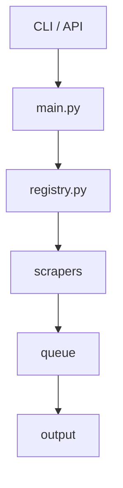

# news-watch Architecture

## Purpose

Scrape structured news data from Indonesian news portals using true keyword search.

## System Flow

## Key Files

| File | Role |
|---|---|
| `registry.py` | Single source of truth — status, metadata, runtime loading |
| `main.py` | Orchestrates scraper selection and execution |
| `api.py` | Python API (`scrape`, `scrape_to_df`, etc.) |
| `cli.py` | CLI entry point |
| `scrapers/basescraper.py` | Abstract contract — `build_search_url`, `parse_article_links`, `get_article` |
| `utils.py` | `AsyncScraper` — concurrency, WAF fallback (aiohttp → rnet → Playwright) |

## Scraper States

| State | Meaning |
|---|---|
| **stable** | passes strict search; included in runtime and tests |
| **quarantined** | known search issues; excluded from runtime |
| **investigating** | not yet classified |

Only `stable` entries are loaded at runtime. The test matrix is derived from the registry.

## Validation Gate

A source moves to **stable** only if:
1. positive keyword returns relevant articles
2. nonsense keyword returns zero
3. unrelated keywords yield different links
4. URLs are canonical article pages

## Current State (2026-04-23)

| State | Count |
|---|---|
| stable | 32 |
| quarantined | 0 |
| investigating | 6 |
