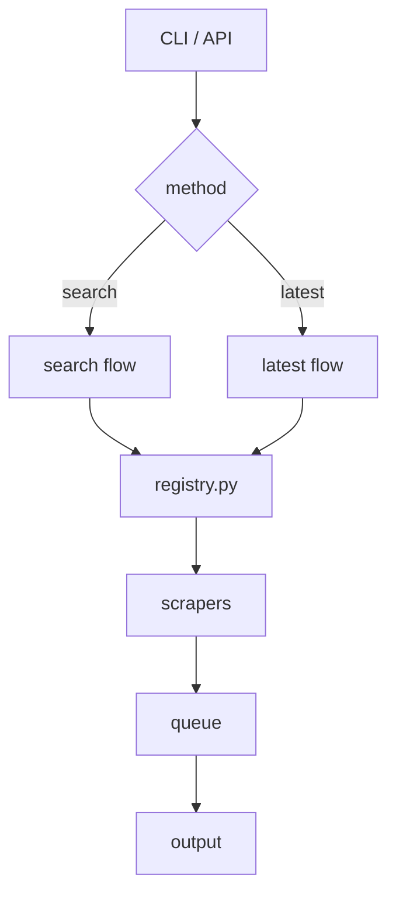

# news-watch Architecture

## Purpose

Collect structured news through verified keyword search and current-article discovery.

## System Flow

## Key Files

| File | Role |
|---|---|
| `registry.py` | Single source of truth for status, capabilities, metadata, runtime loading, tests, and generated documentation |
| `main.py` | Orchestrates scraper selection and execution |
| `api.py` | Synchronous Python API (`scrape`, `scrape_to_dataframe`, latest and health helpers) |
| `cli.py` | CLI entry point |
| `scrapers/basescraper.py` | Abstract contract — `build_search_url`, `parse_article_links`, `get_article` |
| `utils.py` | `AsyncScraper` — concurrency, WAF fallback (aiohttp → rnet → Playwright) |

## Retrieval Methods

| Method | Meaning |
|---|---|
| `search` | keyword/date search for research workflows |
| `latest` | newest-article collection for monitoring workflows |

## Scraper States

| State | Meaning |
|---|---|
| **stable** | capability validated; eligible for its declared search/latest methods |
| **quarantined** | known search issues; excluded from runtime |
| **investigating** | not yet classified |

Only `stable` entries are loaded at runtime. Runtime selection, capability tests, live matrices, and generated source counts derive from the registry.

## Validation Gate

A source declares search support only if:

1. a relevant keyword returns relevant articles
2. a nonsense keyword returns zero
3. unrelated keywords yield different links
4. extracted URLs are canonical same-site article pages

Latest support is validated independently; a source can be latest-only.

<!-- BEGIN GENERATED: architecture-state -->
## Current State

| State | Count |
|---|---|
| registered | 77 |
| stable | 75 |
| quarantined | 1 |
| investigating | 1 |
<!-- END GENERATED: architecture-state -->
