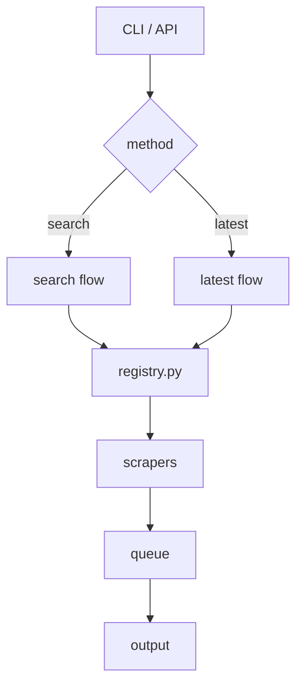

# news-watch Architecture

## Purpose

Collect structured news through verified keyword search and current-article discovery.

## System Flow

```mermaid
flowchart TD
    A[CLI / API] --> B{method}
    B -->|search| C[search flow]
    B -->|latest| D[latest flow]
    C --> E[registry.py]
    D --> E
    E --> F[scrapers]
    F --> G[queue]
    G --> H[output]
```

## Key Files

| File | Role |
|---|---|
| `registry.py` | Single source of truth for status, capabilities, metadata, runtime loading, tests, and generated documentation; declares `browser_required` and `keyword_concurrency` per source |
| `main.py` | Orchestrates scraper selection, the concurrency cap, and execution |
| `api.py` | Synchronous Python API (`scrape`, `scrape_to_dataframe`, latest and health helpers) — applies the same concurrency cap as the CLI |
| `cli.py` | CLI entry point |
| `scrapers/basescraper.py` | Abstract contract — `build_search_url`, `parse_article_links`, `get_article` |
| `utils.py` | `AsyncScraper` — request and keyword concurrency, WAF fallback (aiohttp → rnet → Playwright) |

## Retrieval Methods

| Method | Meaning |
|---|---|
| `search` | keyword/date search for research workflows |
| `latest` | newest-article collection for monitoring workflows |

## Scraper States

| State | Meaning |
|---|---|
| **stable** | capability validated; eligible for its declared search/latest methods |
| **quarantined** | known search issues; excluded from runtime |
| **investigating** | not yet classified |

Only `stable` entries are loaded at runtime. Runtime selection, capability tests, live matrices, and generated source counts derive from the registry.

## Validation Gate

A source declares search support only if:

1. a relevant keyword returns relevant articles
2. a nonsense keyword returns zero
3. unrelated keywords yield different links
4. extracted URLs are canonical same-site article pages

Latest support is validated independently; a source can be latest-only.

## Concurrency Model

Two independent limits apply.

**Across scrapers.** The CLI and the Python API each cap how many scraper
instances run at once (`--max-concurrent-scrapers` / `max_concurrent_scrapers=`,
default 6). Browser-required sources draw from a separate, smaller pool capped
at 2, because each Playwright launch costs a Chromium process rather than a
socket. Selected scrapers therefore run in waves; the CLI's outer batch timeout
is derived from the wave count rather than a fixed ceiling.

**Within one scraper.** `AsyncScraper` holds two distinct semaphores.
`semaphore` bounds concurrent HTTP requests inside `fetch()`. `keyword_semaphore`
bounds concurrent per-keyword tasks in `BaseScraper.scrape()` and is sized from
the registry's `keyword_concurrency`, which defaults to 1 for browser-required
sources. Only `fetch()` observes the first, so browser-driven scrapers that
bypass `fetch()` are bounded by the second.

<!-- BEGIN GENERATED: architecture-state -->
## Current State

| State | Count |
|---|---|
| registered | 81 |
| stable | 79 |
| quarantined | 1 |
| investigating | 1 |
<!-- END GENERATED: architecture-state -->
