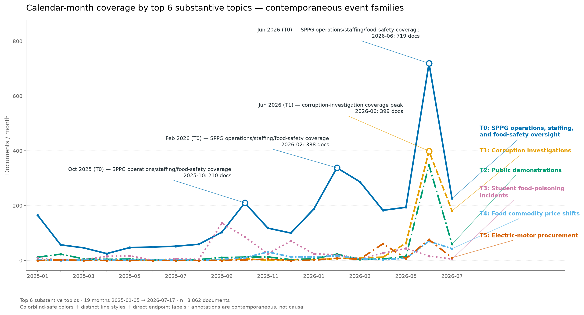
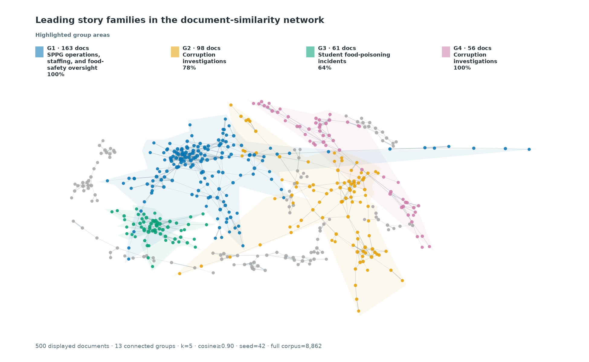
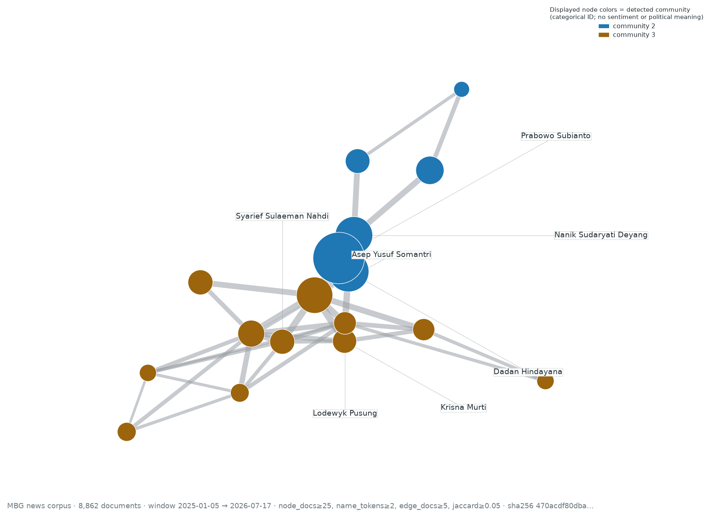

# Use Case MBG: Collecting and Analyzing Indonesian News on Makan Bergizi Gratis

This guide walks the public workflow — from collection through aggregate
analysis — for the *Makan Bergizi Gratis* (MBG) policy research corpus
covering **2025-01-05 through 2026-07-17**, using the `newswatch` registry
as currently configured. It is the companion to `practical-guide.md` and
does not duplicate installation, configuration, or troubleshooting content.

## Background: What Is MBG?

*Makan Bergizi Gratis* (MBG) is Indonesia's national free nutritious-meals
program, administered by the Badan Gizi Nasional (BGN). It provides meals
designed against daily nutritional adequacy standards for school students,
pregnant women, breastfeeding mothers, and young children, delivered through
*Satuan Pelayanan Pemenuhan Gizi* (SPPG), the local service units that
prepare and distribute meals.

BGN describes MBG as both a nutrition intervention and a platform for
nutrition education, and its operating model links SPPG procurement with
local farmers, fishers, cooperatives, and small businesses. That scale makes
MBG a useful news research case: reporting spans beneficiary access, kitchen
expansion, food safety, procurement, public finance, regional
implementation, oversight, and political accountability.

The corpus starts on **5 January 2025**, when BGN formally introduced the
2025 program, and includes implementation from **6 January 2025** onward.
Official program context and operating details:

- [BGN's program launch statement](https://www.bgn.go.id/news/artikel/bgn-akan-memulai-program-mbg-secara-bertahap)
- [BGN's MBG frequently asked questions](https://www.bgn.go.id/faq)
- [BGN's SPPG quality-oversight statement](https://www.bgn.go.id/news/siaran-pers/bgn-perkuat-pengawasan-sppg-untuk-menjaga-kualitas-penyelenggaraan-program-mbg)

## Collection Command

Run the stable, search-capable registry subset against the MBG keywords for
the declared window. `--scrapers all` resolves every stable entry with
`supports_search=True`, not all 75 registered sources.

```bash
uv run newswatch \
  --method search \
  --keywords "mbg,makan bergizi gratis,program MBG,satuan pelayanan pemenuhan gizi,SPPG,badan gizi nasional" \
  --start_date "2025-01-05" \
  --daterange "2025-01-05/2026-07-17" \
  --scrapers all \
  --scraper-timeout 180 \
  --output_format jsonl \
  --output_path mbg-all.jsonl \
  --progress
```

What `--scrapers all` resolves to in this repo:

- 75 registry entries total.
- 68 stable entries support search and are resolved by `--scrapers all`.

## Corpus Validation

Validate each collection before analysis; retrieval totals are evidence
about that run, not fixed properties of the news ecosystem.

1. **Check the schema.** Require `title`, `publish_date`, `content`, `link`,
   and `source` on every record. Reject malformed rows rather than filling
   missing evidence with inferred values.
2. **Enforce the study window.** Parse publication timestamps and retain only
   2025-01-05 00:00:00 through 2026-07-17 23:59:59 (both full calendar days).
3. **Confirm relevance.** Keep a record only when its title contains
   a standalone program term — `MBG`, `SPPG`, or `BGN` — or an explicit
   program phrase: `Makan Bergizi Gratis`, `Program MBG`, `satuan
   pelayanan pemenuhan gizi`, or `Badan Gizi Nasional`. Matching is
   case-insensitive, acronym boundaries reject collisions such as
   `PVMBG`, and title anchoring excludes tangential articles that
   mention an MBG term only in the body.
4. **Remove duplicates in order.** Deduplicate exact article links first,
   then lowercase and collapse whitespace in titles before removing repeated
   titles. Preserve the number removed at each step so the final corpus is
   auditable.
5. **Publish aggregates only.** Reconcile retained records by source and
   calendar month, but keep article text, titles, URLs, and document-level
   outputs in the private research workspace.

The **reference run** (collected 2026-07-17) documented in this guide
yielded 25,288 well-formed records before cleaning, 18,406 after relevance
filtering, 8,895 after URL deduplication, and **8,862 cleaned documents**
from **48 contributing sources** across all **19 calendar months** in the
window. These are one run's retrieval counts, not estimates of article
production; inspect the actual numbers in each run rather than treating one
retrieval as a fixed benchmark.

## Aggregate Analysis

All figures below describe the reference run's cleaned corpus. Topic
annotations are **provisional English summaries** derived from
auto-generated Indonesian term statistics and a manual review of private
topic assignments; named entities retain their source-language proper names.
Treat both as working labels pending further validation before citing them
as facts.

### Topic landscape and prevalence

The cleaned corpus resolves to **14 substantive topics plus an outlier
class**. The substantive topics span SPPG operations, staffing, and
food-safety oversight, corruption investigations, public demonstrations,
student food-poisoning incidents, food commodity price shifts,
electric-motor procurement, viral media and political-figure mentions,
dairy production and consumption, MBG insurance and fiscal protection,
flood response and emergency SPPG distribution, TB patient support and
treatment, global oil prices and budget pressure, suspected fictitious SPPG
locations, and fisheries, aquaculture, and marine food supply; the
outlier class captures documents that do not cluster cleanly with any
dominant theme.


A two-dimensional UMAP projection of the cleaned documents, colored by
topic; each point is one document. All 14 substantive topics are labeled
directly over their cluster regions, and grey points are documents the
clustering model left unassigned. Separation and overlap are diagnostic
patterns, not proof that the generated labels are definitive categories.
The scatter uses a dedicated readability projection (`random_state=42`,
`n_neighbors=30`, `min_dist=0.3`, `metric=cosine`), distinct from the
analysis UMAP inside the BERTopic pipeline that produces the topic
assignments; only the two-dimensional layout differs, never the assignments.


Topic-size distribution ordered largest to smallest, including the outlier
class. The three largest topics account for **4,416 of 8,862 cleaned
documents (49.8%)**; the remainder spreads across the other 11 substantive
topics and the outlier class.



Per-topic volume over the 19 calendar months for the **six largest
topics**: T0 SPPG operations, staffing, and food-safety oversight, T1
corruption investigations, T2 public demonstrations, T3 student
food-poisoning incidents, T4 food commodity price shifts, and T5
electric-motor procurement. Each topic uses a distinct colorblind-safe
color and line style, with the topic label printed directly at the
right-hand endpoint of every line, so each series stays legible without
relying on color alone.

Four callouts report exact monthly counts and mark contemporaneous coverage
families rather than causal triggers:

- **October 2025 — T0, 210 documents:** SPPG operations, staffing, and
  food-safety oversight coverage.
- **February 2026 — T0, 338 documents:** SPPG operations, staffing, and
  food-safety oversight coverage.
- **June 2026 — T0, 719 documents:** SPPG operations, staffing, and
  food-safety oversight coverage.
- **June 2026 — T1, 399 documents:** corruption-investigation coverage peak.

In **June 2026** the three largest topics combined reach **1,466 documents**
— about **4.0×** their previous combined monthly peak of **368**.
Annotations describe news coverage families that align with each spike, not
claims that those events caused the observed volume; the pattern describes
this retrieved corpus and should not be extrapolated beyond 2026-07-17.

Independent public reporting documents the same coverage families without
quoting private records:

- [Bandung Barat mass-poisoning response, ANTARA (September 2025)](https://www.antaranews.com/berita/5129056/pemkab-bandung-barat-tetapkan-klb-usai-ratusan-siswa-keracunan-mbg)
- [Ramadan dry-food adaptation statement, ANTARA](https://en.antaranews.com/news/405814/free-meals-nutrition-maintained-despite-dry-food-shift-minister)
- [BGN school-holiday audit of MBG kitchens, ANTARA](https://en.antaranews.com/news/419313/bgn-to-fully-audit-free-meal-kitchens-during-school-holidays)
- [SPPG safety certification push after poisoning cases, Kompas](https://money.kompas.com/read/2025/10/03/100000126/usai-kasus-keracunan-bgn-ngebut-sertifikasi-sppg-agar-pangan-aman-)

### Document-similarity network

The method builds an undirected graph over the cleaned-document embeddings.
Each node is one document; an edge connects two documents when their cosine
similarity is at least **0.90** among each document's **k=5** nearest
neighbors.

The full graph contains **1,866 active nodes and 1,936 edges** across
**533 active connected components**, with **6,996 isolates**. The bounded
figure displays **60 communities within the 13 largest component groups**
under a **500-node cap**, rendering **500 linked documents**; smaller
components are shown in grey and carry no group annotations.



The four leading groups shown are:

- **G1 — SPPG operations, staffing, and food-safety oversight: 163
  documents, 100% dominant.**
- **G2 — corruption investigations: 98 documents, 77.6% dominant.**
- **G3 — student food-poisoning incidents: 61 documents, 63.9% dominant.**
- **G4 — corruption investigations (separate component): 56 documents,
  100% dominant.**

The fitted color areas follow the displayed component extent only — they
are not confidence regions, ground-truth boundaries, or calibrated
estimates. "Dominant" is the share of documents inside the displayed
component carrying the indicated topic label, not a probability that the
component is exclusively about that topic.

**Interpretation boundary.** Proximity and edges mean embedding similarity
between retrieved documents — not shared event identity, factual
equivalence, causation, coordination, or editorial influence. The
deterministic spring layout (`seed=42`) makes the figure reproducible, but
placement is meaningful only insofar as it reveals the connected
components. Article-level evidence remains private.

### Sentiment by topic

News tone varies substantially by topic. Among the larger substantive
topics, student food-poisoning incidents (T3, **n=518**) show the clearest
negative pattern: **58.9%** of documents have `negative` as their
highest-probability label and the mean probability score is **−0.46**.
Corruption investigations (T1, **n=696**) are mostly neutral by
highest-probability label (**55.9%**) but still carry a negative mean score
(**−0.38**), reflecting very little positive probability. By contrast,
food commodity price shifts (T4, **n=228**) have a positive mean score of
**+0.10**.


The figure reports each document's highest-probability label as a share of
its topic; the centered grey marker indicates neutral classification, and
the ordering uses the topic mean of `P(positive) − P(negative)`. The two
measures can differ: SPPG operations, staffing, and food-safety oversight
(T0, **n=3,166**) has **892 positive**, **1,411 neutral**, and **863
negative** highest-probability labels with a mean score of **+0.02**.
Smaller substantive topics contain at most 92 documents each (T6 viral
media and political-figure mentions), so their directions are especially
provisional. The heterogeneous outlier class is retained in aggregate
reconciliation but omitted from this substantive-topic figure.

Overall, the cleaned corpus shows **2,206 positive**, **3,536 neutral**,
and **3,120 negative** highest-probability labels. The figure is the public
aggregate output; document-level predictions and the underlying review
tables remain private.

**Interpretation boundary.** The pinned Indonesian RoBERTa classifier was
trained on IndoNLU SmSA comments and reviews, not MBG news. Its outputs
describe the language tone of retrieved articles after right truncation at
512 model tokens — not public opinion, policy effectiveness, factuality, or
stance — and the probabilities are ordinal comparisons, not calibrated
population estimates.

### Named entities and SPPG kitchens

Provisional entity extraction surfaces the most-mentioned people, event
locations, and SPPG/Dapur kitchen references in the corpus. The figures
below are aggregate counts; surface-form resolution is provisional.


Top-mentioned multi-token people: **50,486 mentions resolved to 5,660
normalized surfaces**. Ranks describe prominence in this retrieved corpus,
not policy importance. Audited aliases combine `Purbaya`, `Purba`, `Yudhi`,
and `Yudhi Sadewa` with **Purbaya Yudhi Sadewa (1,316 mentions across 320
documents)**. Ambiguous single-token surfaces such as `Yusuf` are retained
in aggregate tables but excluded from this precision-oriented chart rather
than assigned to one person.


Top event locations: **1,854 mentions resolving to 542 unique places**.
Counts **exclude publisher datelines and general geographic framing** —
only locations anchored to a described event (visit, launch, incident,
audit) are counted — so the chart under-represents places that appear only
as byline cities or background geography.


Top SPPG/Dapur (*satuan pelayanan pemenuhan gizi*) kitchen references:
**1,411 mentions resolving to 699 unique kitchen surfaces**. Unit numbers
are preserved where available; strict normalization excludes regional
collectives and malformed identifiers. These automated identifiers remain
provisional until reconciled against operational records.

### Person co-mention network

The method builds an undirected graph over the cleaned corpus. Each node is
one normalized person surface; an edge connects two nodes when both people
occur in the same document, with repeated mentions of the same normalized
person deduplicated within a document before document and edge counts are
incremented.

These gates produce **30 nodes and 44 edges** across **7 connected
components** and **8 detected communities**.



The method uses the full corpus and all eligible components; the figure
displays only the largest connected component (**17 nodes**) for
readability, with a deterministic spring layout (`seed=42`). Larger nodes
represent people mentioned in more documents; wider edges represent higher
co-document counts. Node colors distinguish only the detected communities
visible in the displayed component — categorical IDs, not sentiment or
political-polarity scores.

By weighted degree, the most connected eligible surfaces are **Sony Sonjaya
(1,145, 743 documents)**, **Prabowo Subianto (1,086, 3,027 documents)**,
**Dadan Hindayana (910, 1,183 documents)**, **Nanik Sudaryati Deyang
(751, 843 documents)**, and **Asep Yusuf Somantri (373, 222 documents)**.
The strongest single edge is **Dadan Hindayana ↔ Prabowo Subianto** with
**478 co-mentioned documents** (Jaccard 0.13). Other top edges: Nanik
Sudaryati Deyang ↔ Prabowo Subianto (398), Dadan Hindayana ↔ Sony Sonjaya
(219), Prabowo Subianto ↔ Sony Sonjaya (210), and Asep Yusuf Somantri ↔
Sony Sonjaya (172).
Names remain provisional NER surfaces: there is no general co-reference
resolution, and ambiguous identities may still split or merge. Audited
`Purbaya`/`Yudhi Sadewa` fragments are canonicalized to `Purbaya Yudhi
Sadewa`; ambiguous bare `Yusuf` remains unresolved and is excluded by the
two-token precision gate. No article-level evidence is published.

**Interpretation boundary.** Co-mention indicates only shared coverage
within the same retrieved document — not a personal relationship,
influence, endorsement, coordination, political alignment, or causality.

## Collection Limitations

- **Retrieval coverage.** Only registry sources are searched. The stable
  search-capable subset is 68 of 75 entries (see the resolver breakdown in
  [Collection Command](#collection-command)), and 48 sources contributed
  documents retained after cleaning.
- **Keyword recall.** Retrieval uses six related queries: `mbg`, `makan
  bergizi gratis`, `program MBG`, `satuan pelayanan pemenuhan gizi`, `SPPG`,
  and `badan gizi nasional`. Articles that discuss implementation without
  any of those terms can still be missed.
- **Completeness.** A finished corpus is bounded by what each scraper's
  search endpoint exposes. Some sources cap depth, return only top-N, or
  paginate inconsistently; re-running with a tighter window or
  source-by-source will not necessarily close those gaps.
- **Copyright.** Each row is a *news article record*: title, link, publish
  date, author, and a content excerpt as returned by the source's own
  feed/page. The corpus supports aggregate analysis, citation (see
  [How to Cite](#how-to-cite)), and downstream modeling within fair-use
  research bounds; it is not a redistribution of full article text. Honor
  each publisher's terms.

## How to Cite

**This guide.** Cite the guide itself as part of the `news-watch`
documentation:

```bibtex
@misc{mabruri_usecase_mbg_2026,
  author       = {Okky Mabruri},
  title        = {Use Case MBG: Collecting and Analyzing Indonesian News
                  on Makan Bergizi Gratis},
  year         = {2026},
  howpublished = {news-watch documentation, v1.2.0},
  doi          = {10.5281/zenodo.14908389},
  url          = {https://github.com/okkymabruri/news-watch/blob/main/docs/use-case-mbg.md}
}
```

**Software.** Cite `news-watch` using the repository's `CITATION.cff`
(v1.2.0, DOI
[10.5281/zenodo.14908389](https://doi.org/10.5281/zenodo.14908389)):

```bibtex
@software{mabruri_newswatch,
  author = {Okky Mabruri},
  title = {news-watch},
  year = {2025},
  doi = {10.5281/zenodo.14908389}
}
```

**Corpus and figures.** Cite aggregate figures as products of this guide's
reference run, for example:

> MBG news corpus (2025-01-05 to 2026-07-17), collected with news-watch
> v1.2.0; aggregate figures only.
> https://github.com/okkymabruri/news-watch

Article-level records are not redistributed, so cite counts and figures,
not private document tables.

**News articles.** When quoting an individual article (including the linked
ANTARA and Kompas reports above), cite the publisher, article title,
publication date, and URL; the corpus record is a pointer, not the source
of record.
