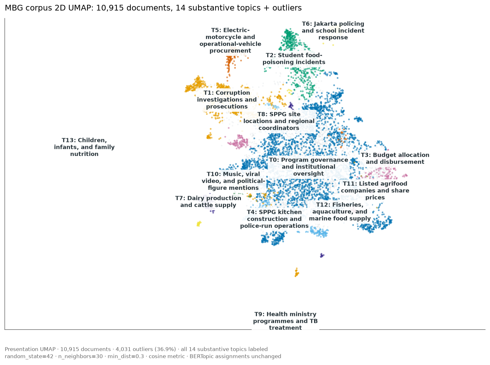
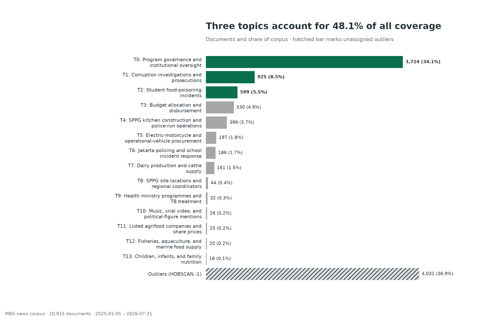
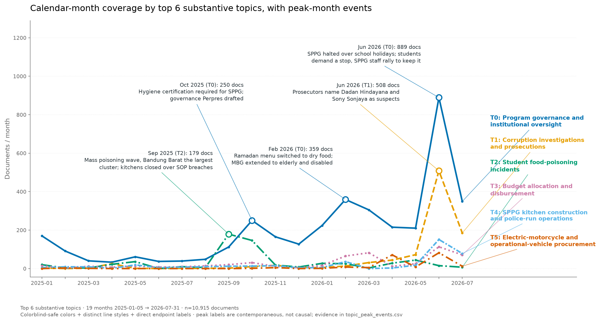
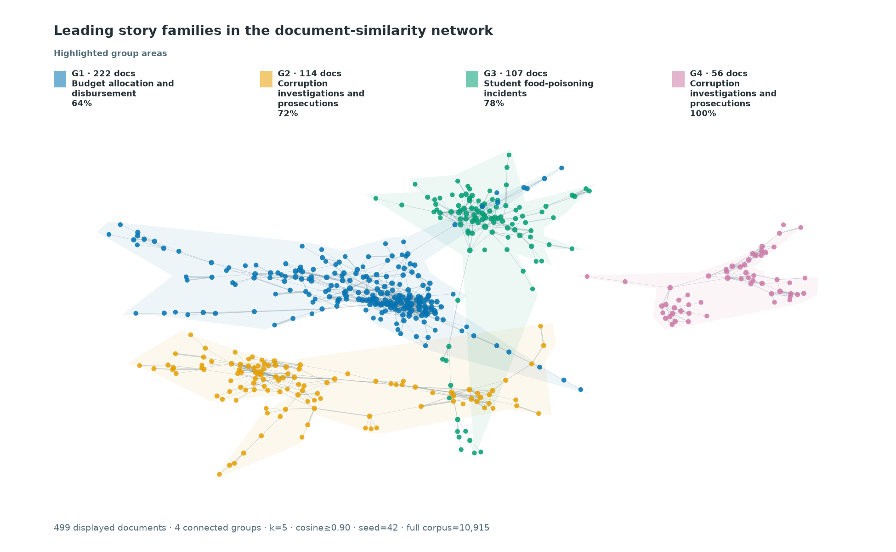
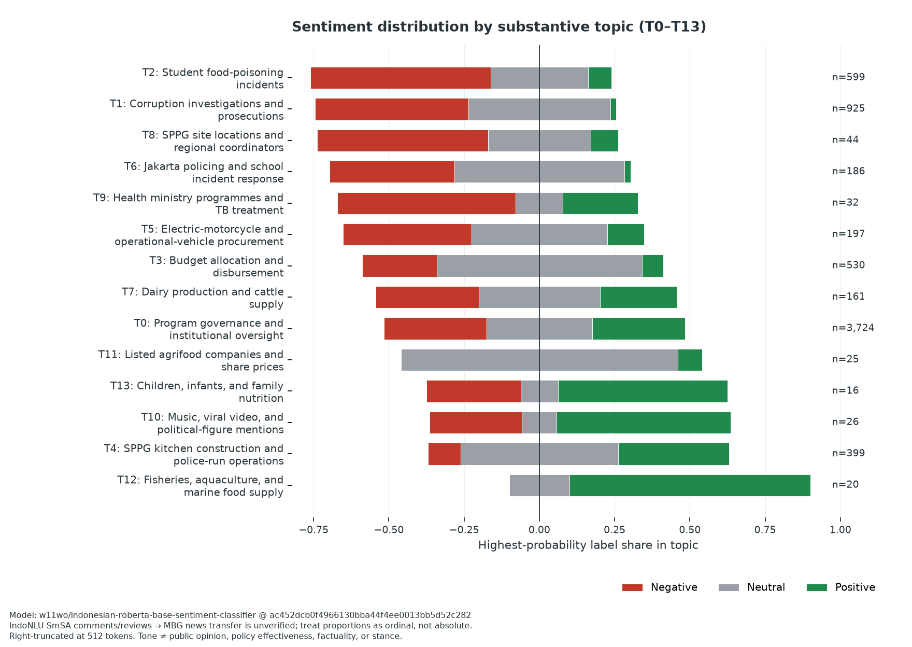
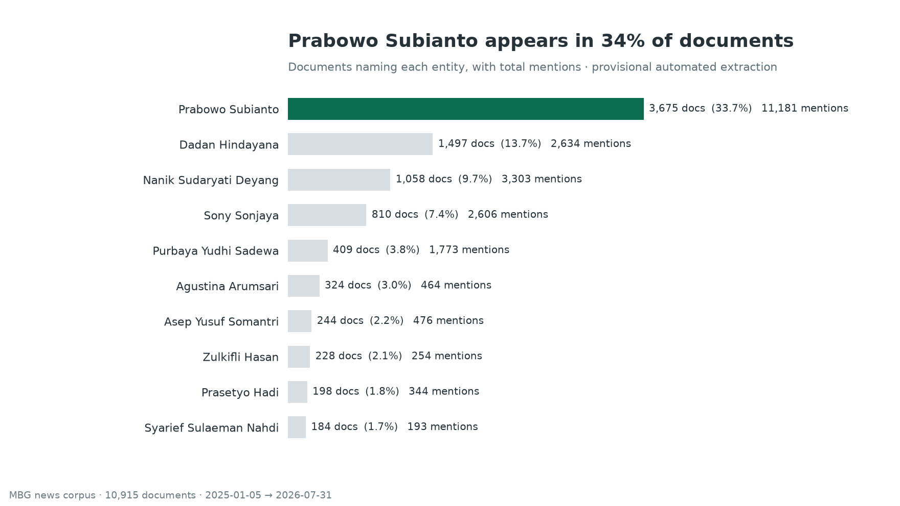
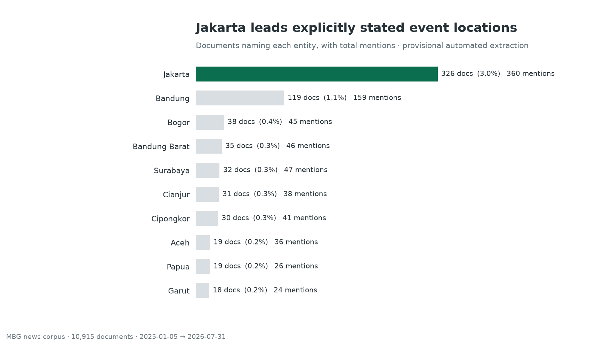
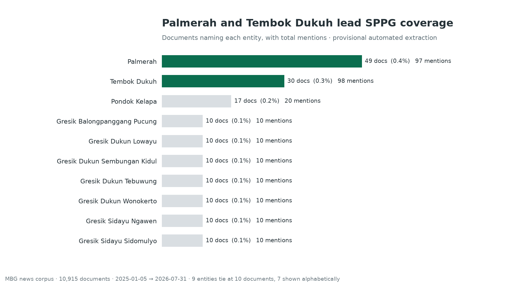
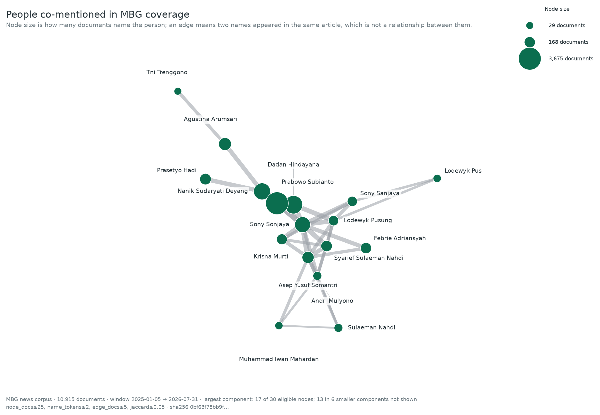

# Use Case MBG: Collecting and Analyzing Indonesian News on Makan Bergizi Gratis

This guide walks the public workflow, from collection through aggregate
analysis, for the *Makan Bergizi Gratis* (MBG) policy research corpus
covering **2025-01-05 through 2026-07-31**, using the `newswatch` registry
as currently configured. It is the companion to `practical-guide.md` and
does not duplicate installation, configuration, or troubleshooting content.

**Last updated 2026-08-08** against the 2026-08-06 collection run
(10,915 cleaned documents, 52 sources). This supersedes an earlier edition
built on a smaller run over a shorter window; every figure and count below
has been regenerated, and the superseded totals are not carried forward.

## Background: What Is MBG?

*Makan Bergizi Gratis* (MBG) is Indonesia's national free nutritious-meals
program, administered by the Badan Gizi Nasional (BGN). It provides meals
designed against daily nutritional adequacy standards for school students,
pregnant women, breastfeeding mothers, and young children, delivered through
*Satuan Pelayanan Pemenuhan Gizi* (SPPG), the local service units that
prepare and distribute meals.

BGN describes MBG as both a nutrition intervention and a platform for
nutrition education, and its operating model links SPPG procurement with
local farmers, fishers, cooperatives, and small businesses. That scale makes
MBG a useful news research case: reporting spans beneficiary access, kitchen
expansion, food safety, procurement, public finance, regional
implementation, oversight, and political accountability.

The corpus starts on **5 January 2025**, when BGN formally introduced the
2025 program, and includes implementation from **6 January 2025** onward.
Official program context and operating details:

- [BGN's program launch statement](https://www.bgn.go.id/news/artikel/bgn-akan-memulai-program-mbg-secara-bertahap)
- [BGN's MBG frequently asked questions](https://www.bgn.go.id/faq)
- [BGN's SPPG quality-oversight statement](https://www.bgn.go.id/news/siaran-pers/bgn-perkuat-pengawasan-sppg-untuk-menjaga-kualitas-penyelenggaraan-program-mbg)

## Collection Command

Run the stable, search-capable registry subset against the MBG keywords for
the declared window. During the documented collection, `--scrapers all`
resolved every stable entry with `supports_search=True`, not all 75 sources
then registered.

```bash
uv run newswatch \
  --method search \
  --keywords "mbg,makan bergizi gratis,program MBG,satuan pelayanan pemenuhan gizi,SPPG,badan gizi nasional" \
  --start_date "2025-01-05" \
  --daterange "2025-01-05/2026-07-31" \
  --scrapers all \
  --scraper-timeout 180 \
  --max-concurrent-scrapers 6 \
  --output_format jsonl \
  --output_path mbg-all.jsonl \
  --progress
```

Sources run in waves under the concurrency cap, so wall-clock time is
roughly (sources ÷ cap) × `--scraper-timeout`, not a single flat timeout.

What `--scrapers all` resolves to in this repo:

- 75 registry entries total.
- 68 stable entries support search and are resolved by `--scrapers all`.

## Corpus Validation

Validate each collection before analysis; retrieval totals are evidence
about that run, not fixed properties of the news ecosystem.

1. **Check the schema.** Require `title`, `publish_date`, `content`, `link`,
   and `source` on every record. Reject malformed rows rather than filling
   missing evidence with inferred values.
2. **Enforce the study window.** Parse publication timestamps and retain only
   2025-01-05 00:00:00 through 2026-07-31 23:59:59 (both full calendar days).
3. **Confirm relevance.** Keep a record only when its title contains
   a standalone program term (`MBG`, `SPPG`, or `BGN`) or an explicit
   program phrase: `Makan Bergizi Gratis`, `Program MBG`, `satuan
   pelayanan pemenuhan gizi`, or `Badan Gizi Nasional`. Matching is
   case-insensitive, acronym boundaries reject collisions such as
   `PVMBG`, and title anchoring excludes tangential articles that
   mention an MBG term only in the body.
4. **Remove duplicates in order.** Deduplicate exact article links first,
   then lowercase and collapse whitespace in titles before removing repeated
   titles. Preserve the number removed at each step so the final corpus is
   auditable.
5. **Publish aggregates only.** Reconcile retained records by source and
   calendar month, but keep article text, titles, URLs, and document-level
   outputs in the private research workspace.

The **reference run** (collected 2026-08-06) documented in this guide
yielded 27,927 well-formed records before cleaning, 20,992 after relevance
filtering, 10,957 after URL deduplication, and **10,915 cleaned documents**
from **52 contributing sources** across all **19 calendar months** in the
window. These are one run's retrieval counts, not estimates of article
production; inspect the actual numbers in each run rather than treating one
retrieval as a fixed benchmark.

## Aggregate Analysis

All figures below describe the reference run's cleaned corpus. Topic
annotations are **provisional English summaries** derived from
auto-generated Indonesian term statistics and a manual review of private
topic assignments; named entities retain their source-language proper names.
Treat both as working labels pending further validation before citing them
as facts.

### Topic landscape and prevalence

The cleaned corpus resolves to **14 substantive topics plus an outlier
class**. The substantive topics span program governance and
institutional oversight, corruption investigations and prosecutions,
student food-poisoning incidents, budget allocation and disbursement, SPPG
kitchen construction and police-run operations, electric-motorcycle and
operational-vehicle procurement, Jakarta policing and school incident
response, dairy production and cattle supply, SPPG site locations and
regional coordinators, health ministry programmes and TB treatment, music
and viral video mentions, listed agrifood companies and share prices,
fisheries, aquaculture, and marine food supply, and children, infants, and
family nutrition; the outlier class captures documents that do not cluster
cleanly with any dominant theme.

**The outlier class is large and is disclosed rather than hidden: 4,031
documents (36.9%) carry no topic**, so any topic-level statement below
describes the remaining 63%.



A two-dimensional UMAP projection of the cleaned documents, colored by
topic; each point is one document. All 14 substantive topics are labeled
directly over their cluster regions, and grey points are documents the
clustering model left unassigned. Separation and overlap are diagnostic
patterns, not proof that the generated labels are definitive categories.
The scatter uses a dedicated readability projection (`random_state=42`,
`n_neighbors=30`, `min_dist=0.3`, `metric=cosine`), distinct from the
analysis UMAP inside the BERTopic pipeline that produces the topic
assignments; only the two-dimensional layout differs, never the assignments.



Topic-size distribution ordered largest to smallest, including the outlier
class. The three largest topics account for **5,248 of 10,915 cleaned
documents (48.1%)**; T0 alone holds 3,724, so topic structure outside T0
rests on roughly a quarter of the corpus. The remainder spreads across the
other 11 substantive topics and the outlier class.



Per-topic volume over the 19 calendar months for the **six largest
topics**: T0 program governance and institutional oversight, T1 corruption
investigations and prosecutions, T2 student food-poisoning incidents, T3
budget allocation and disbursement, T4 SPPG kitchen construction and
police-run operations, and T5 electric-motorcycle and operational-vehicle
procurement. Each topic uses a distinct colorblind-safe color and line
style, with the topic label printed directly at the right-hand endpoint of
every line, so each series stays legible without relying on color alone.

Five callouts mark each annotated peak. The month and the document count are
derived from the corpus at render time; the event text is curated and names
the headline terms it answers to, so a reader can check it against the
published evidence table rather than take it on trust:

- **September 2025, T2, 179 documents:** mass poisoning wave, Bandung Barat
  the largest cluster, kitchens closed over SOP breaches.
- **October 2025, T0, 250 documents:** hygiene certification required for
  SPPG, governance Perpres drafted.
- **February 2026, T0, 359 documents:** Ramadan menu switched to dry food,
  MBG extended to elderly and disabled recipients.
- **June 2026, T1, 508 documents:** prosecutors name Dadan Hindayana and
  Sony Sonjaya as suspects.
- **June 2026, T0, 889 documents:** SPPG halted over school holidays, with
  students demanding a stop and SPPG staff rallying to keep it.

In **June 2026** the three largest topics combined reach **1,412 documents**,
about **3.5×** their previous combined monthly peak of **406**. On all
documents rather than the top three, the same month is **3.20×** its
predecessor (2,761 against 863 in October 2025).

**Treat the peak as real and the multiple as an upper bound.** Distinct
sources contributing per month rise from 17 to 45 across the window, so
later months are searchable by more sources than earlier ones and raw
month-over-month growth is partly a coverage artifact. Any published
trendline should ship the sources-per-month series beside it. Annotations
describe coverage families contemporaneous with each peak, not claims that
those events caused the volume; the pattern describes this retrieved corpus
and should not be extrapolated beyond 2026-07-31.

Independent public reporting documents the same coverage families without
quoting private records:

- [Bandung Barat mass-poisoning response, ANTARA (September 2025)](https://www.antaranews.com/berita/5129056/pemkab-bandung-barat-tetapkan-klb-usai-ratusan-siswa-keracunan-mbg)
- [Ramadan dry-food adaptation statement, ANTARA](https://en.antaranews.com/news/405814/free-meals-nutrition-maintained-despite-dry-food-shift-minister)
- [BGN school-holiday audit of MBG kitchens, ANTARA](https://en.antaranews.com/news/419313/bgn-to-fully-audit-free-meal-kitchens-during-school-holidays)
- [SPPG safety certification push after poisoning cases, Kompas](https://money.kompas.com/read/2025/10/03/100000126/usai-kasus-keracunan-bgn-ngebut-sertifikasi-sppg-agar-pangan-aman-)

### Document-similarity network

The method builds an undirected graph over the cleaned-document embeddings.
Each node is one document; an edge connects two documents when their cosine
similarity is at least **0.90** among each document's **k=5** nearest
neighbors.

The full graph contains **2,636 active nodes and 2,847 edges** across
**735 active connected components**, with **8,279 isolates**. The bounded
figure displays **36 communities within the 4 largest component groups**
under a **500-node cap**, rendering **499 linked documents**; smaller
components are shown in grey and carry no group annotations.



The four leading groups shown are:

- **G1, budget allocation and disbursement: 222 documents, 64.4%
  dominant.**
- **G2, corruption investigations and prosecutions: 114 documents, 71.9%
  dominant.**
- **G3, student food-poisoning incidents: 107 documents, 78.5% dominant.**
- **G4, corruption investigations and prosecutions (separate component): 56
  documents, 100% dominant.**

The fitted color areas follow the displayed component extent only: they
are not confidence regions, ground-truth boundaries, or calibrated
estimates. "Dominant" is the share of documents inside the displayed
component carrying the indicated topic label, not a probability that the
component is exclusively about that topic.

**Interpretation boundary.** Proximity and edges mean embedding similarity
between retrieved documents, not shared event identity, factual
equivalence, causation, coordination, or editorial influence. The
deterministic spring layout (`seed=42`) makes the figure reproducible, but
placement is meaningful only insofar as it reveals the connected
components. Article-level evidence remains private.

### Sentiment by topic

News tone varies substantially by topic. Among the larger substantive
topics, student food-poisoning incidents (T2, **n=599**) show the clearest
negative pattern: **59.9%** of documents have `negative` as their
highest-probability label and the mean probability score is **−0.47**.
Corruption investigations and prosecutions (T1, **n=925**) carry a nearly
identical mean score (**−0.46**) with **50.9%** negative labels and almost
no positive probability. By contrast, SPPG kitchen construction and
police-run operations (T4, **n=399**) have a positive mean score of
**+0.25**.



The figure reports each document's highest-probability label as a share of
its topic; the centered grey marker indicates neutral classification, and
the ordering uses the topic mean of `P(positive) − P(negative)`. The two
measures can differ: program governance and institutional oversight
(T0, **n=3,724**) has **1,145 positive**, **1,310 neutral**, and **1,269
negative** highest-probability labels with a mean score of **−0.02**.
Smaller substantive topics contain at most 186 documents each (T6 Jakarta
policing and school incident response), so their directions are especially
provisional. The heterogeneous outlier class is retained in aggregate
reconciliation but omitted from this substantive-topic figure.

Overall, the cleaned corpus shows **2,620 positive** (24.0%), **4,313
neutral** (39.5%), and **3,982 negative** (36.5%) highest-probability
labels. The figure is the public
aggregate output; document-level predictions and the underlying review
tables remain private.

**Interpretation boundary.** The pinned Indonesian RoBERTa classifier was
trained on IndoNLU SmSA comments and reviews, not MBG news. Its outputs
describe the language tone of retrieved articles after right truncation at
512 model tokens, not public opinion, policy effectiveness, factuality, or
stance, and the probabilities are ordinal comparisons, not calibrated
population estimates.

### Named entities and SPPG kitchens

Provisional entity extraction surfaces the most-mentioned people, event
locations, and SPPG/Dapur kitchen references in the corpus. The figures
below are aggregate counts; surface-form resolution is provisional.



Top multi-token people: **60,886 mentions resolved to 6,343 normalized
surfaces**. Ranks describe prominence in this retrieved corpus, not policy
importance. Audited aliases combine `Purbaya`, `Purba`, `Yudhi`, and `Yudhi
Sadewa` with **Purbaya Yudhi Sadewa (1,773 mentions across 409
documents)**. Ambiguous single-token surfaces such as `Yusuf` are retained
in aggregate tables but excluded from this precision-oriented chart rather
than assigned to one person.

**The three entity charts rank by documents, not mentions.** A single
article naming an entity a dozen times is one article's worth of coverage,
so ranking on raw mentions lets one repetitive story outrank an entity
covered across many. Each bar prints its mention total alongside the
document count, so repetition stays visible.



Top event locations: **1,962 mentions resolving to 562 unique places**.
Counts **exclude publisher datelines and general geographic framing**: only
locations anchored to a described event (visit, launch, incident, audit)
are counted, so the chart under-represents places that appear only as byline
cities or background geography.

Places are **settlements and administrative regions only**. Venues such as
Kompleks Parlemen, Istana Merdeka, and Gedung DPR are excluded: each sits
inside a city that is itself counted, so ranking them together both
double-counts the coverage and puts a building beside a province. Spelling
and granularity variants are merged, and truncation fragments are rejected.



Top SPPG/Dapur (*satuan pelayanan pemenuhan gizi*) kitchen references:
**1,760 mentions resolving to 804 unique kitchen surfaces**. Unit numbers
are preserved where available; strict normalization excludes regional
collectives and malformed identifiers. These automated identifiers remain
provisional until reconciled against operational records.

### Person co-mention network

The method builds an undirected graph over the cleaned corpus. Each node is
one normalized person surface; an edge connects two nodes when both people
occur in the same document, with repeated mentions of the same normalized
person deduplicated within a document before document and edge counts are
incremented.

These gates produce **30 nodes and 42 edges** across **7 connected
components** and **8 detected communities**. The figure draws the largest
component only: **17 of the 30 eligible nodes**, with the remaining 13
spread across 6 smaller components that are not shown. Node area encodes
document count, and **community is deliberately not shown as colour**,
because Louvain community IDs are arbitrary integers and rendering them as
colour on a corpus about a government programme invites a political reading
the data does not support.



The method uses the full corpus and all eligible components; the figure
displays only the largest connected component (**17 nodes**) for
readability, with a deterministic spring layout (`seed=42`). Larger nodes
represent people mentioned in more documents, and wider edges represent
higher co-document counts. Every node in the displayed component is
labelled, and a size legend keys node area to three real document counts.

By weighted degree, the most connected eligible surfaces are **Prabowo
Subianto (1,280, 3,675 documents)**, **Sony Sonjaya (1,275, 810
documents)**, **Dadan Hindayana (1,054, 1,497 documents)**, **Nanik
Sudaryati Deyang (890, 1,058 documents)**, and **Asep Yusuf Somantri (417,
244 documents)**. The strongest single edge is **Dadan Hindayana and
Prabowo Subianto** with **576 co-mentioned documents** (Jaccard 0.13).
Other top edges: Nanik Sudaryati Deyang and Prabowo Subianto (481), Dadan
Hindayana and Sony Sonjaya (235), Prabowo Subianto and Sony Sonjaya (223),
and Asep Yusuf Somantri and Sony Sonjaya (192).
Names remain provisional NER surfaces: there is no general co-reference
resolution, and ambiguous identities may still split or merge. Audited
`Purbaya`/`Yudhi Sadewa` fragments are canonicalized to `Purbaya Yudhi
Sadewa`; ambiguous bare `Yusuf` remains unresolved and is excluded by the
two-token precision gate. No article-level evidence is published.

**Interpretation boundary.** Co-mention indicates only shared coverage
within the same retrieved document, not a personal relationship,
influence, endorsement, coordination, political alignment, or causality.

## Collection Limitations

- **Retrieval coverage.** Only registry sources are searched. The stable
  search-capable subset is 68 of 75 entries (see the resolver breakdown in
  [Collection Command](#collection-command)), and 48 sources contributed
  documents retained after cleaning.
- **Keyword recall.** Retrieval uses six related queries: `mbg`, `makan
  bergizi gratis`, `program MBG`, `satuan pelayanan pemenuhan gizi`, `SPPG`,
  and `badan gizi nasional`. Articles that discuss implementation without
  any of those terms can still be missed.
- **Completeness.** A finished corpus is bounded by what each scraper's
  search endpoint exposes. Some sources cap depth, return only top-N, or
  paginate inconsistently; re-running with a tighter window or
  source-by-source will not necessarily close those gaps.
- **Copyright.** Each row is a *news article record*: title, link, publish
  date, author, and a content excerpt as returned by the source's own
  feed/page. The corpus supports aggregate analysis, citation (see
  [How to Cite](#how-to-cite)), and downstream modeling within fair-use
  research bounds; it is not a redistribution of full article text. Honor
  each publisher's terms.

## How to Cite

**This guide.** Cite the guide itself as part of the `news-watch`
documentation:

```bibtex
@misc{mabruri_usecase_mbg_2026,
  author       = {Okky Mabruri},
  title        = {Use Case MBG: Collecting and Analyzing Indonesian News
                  on Makan Bergizi Gratis},
  year         = {2026},
  howpublished = {news-watch documentation, v1.2.0},
  doi          = {10.5281/zenodo.14908389},
  url          = {https://github.com/okkymabruri/news-watch/blob/main/docs/use-case-mbg.md}
}
```

**Software.** Cite `news-watch` using the repository's `CITATION.cff`
(v1.2.0, DOI
[10.5281/zenodo.14908389](https://doi.org/10.5281/zenodo.14908389)):

```bibtex
@software{mabruri_newswatch,
  author = {Okky Mabruri},
  title = {news-watch},
  year = {2025},
  doi = {10.5281/zenodo.14908389}
}
```

**Corpus and figures.** Cite aggregate figures as products of this guide's
reference run, for example:

> MBG news corpus (2025-01-05 to 2026-07-31), collected with news-watch
> v1.2.0; aggregate figures only.
> https://github.com/okkymabruri/news-watch

Article-level records are not redistributed, so cite counts and figures,
not private document tables.

**News articles.** When quoting an individual article (including the linked
ANTARA and Kompas reports above), cite the publisher, article title,
publication date, and URL; the corpus record is a pointer, not the source
of record.
