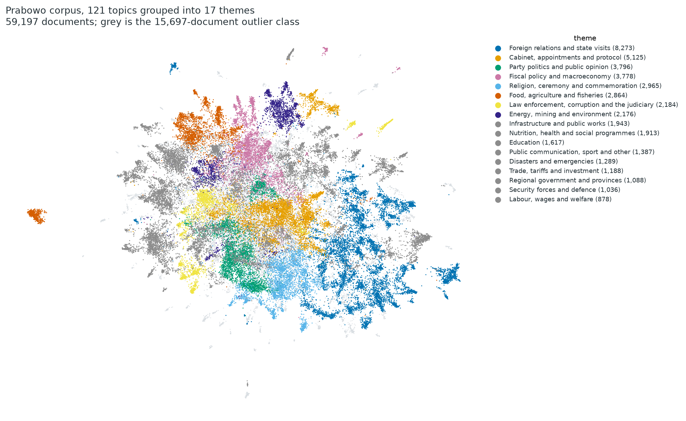
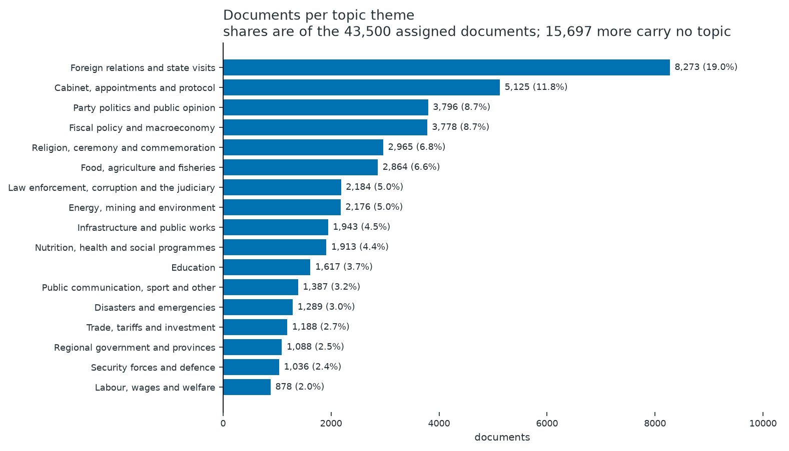
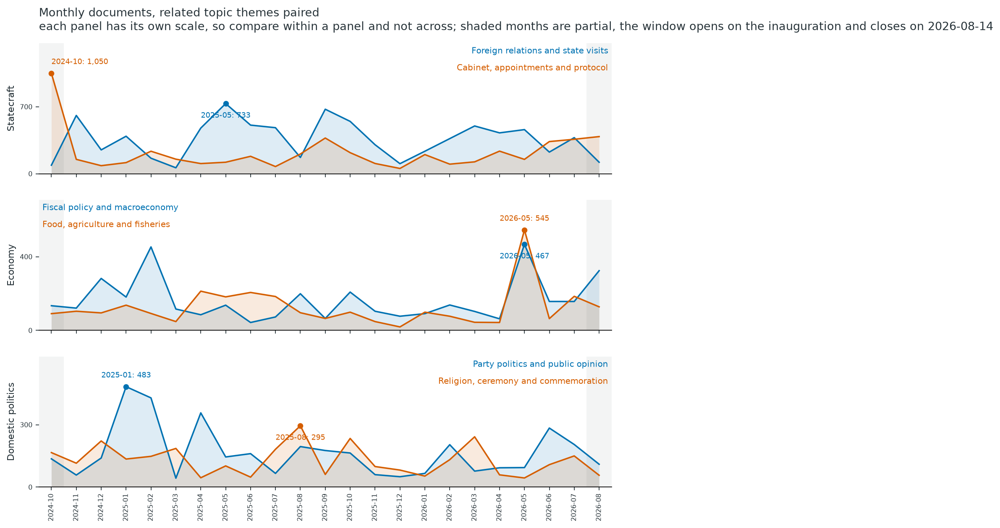
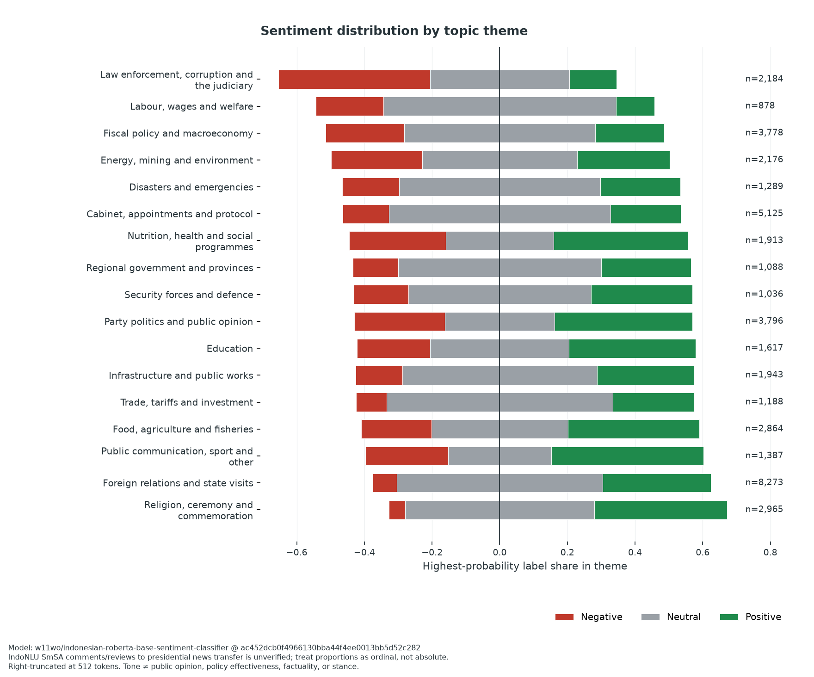
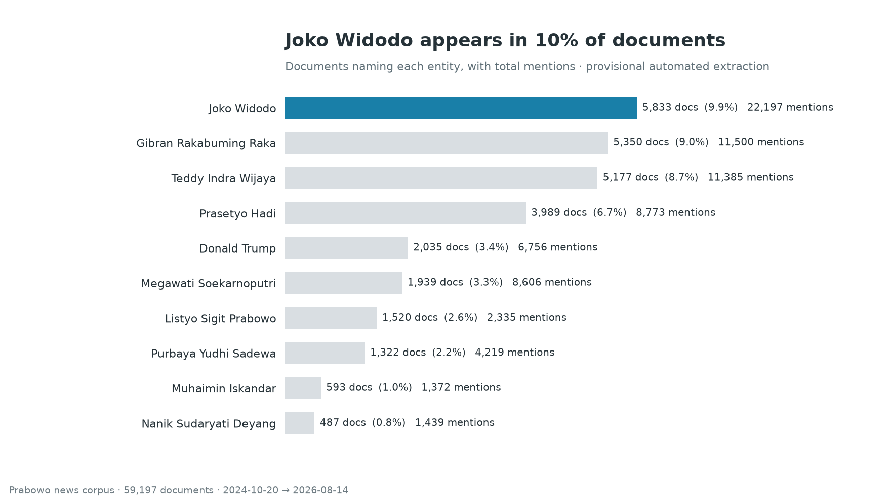
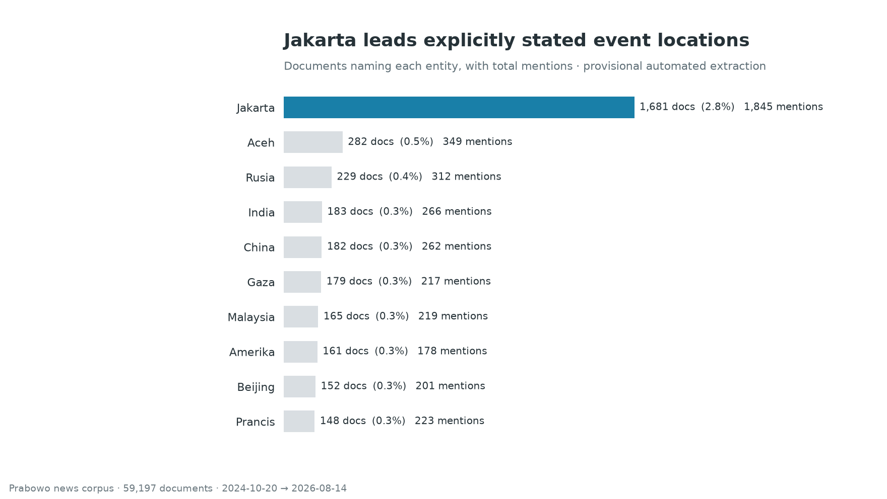
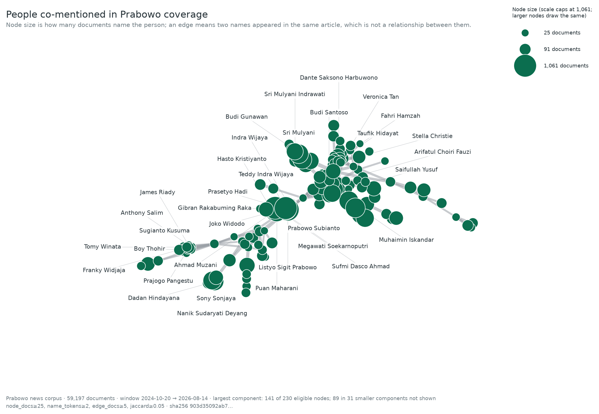
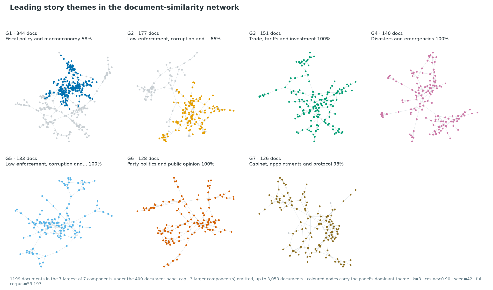

# Use Case Prabowo: Collecting and Analysing Indonesian News Naming the President

Indonesian news portals published **59,197 articles with Prabowo Subianto in the
headline**, from his inauguration on 20 October 2024 to 14 August 2026. 53
sources, 23 months. Three things stand out.

**1. Foreign policy dominates.** 19.0% of the coverage, spread across 28 separate
topics. No other theme reaches 12%. Bilateral meetings are the most regularly
reported thing a president does.

**2. The tightest cluster of names is business, not politics.** Conglomerate
figures get named together about four times more often than senior politicians
do.

**3. Half the coverage is neutral in tone.** Almost all of the negative sits in
one theme: law enforcement and the judiciary.

Before quoting any topic-level number, read
[Topic resolution](#topic-resolution-and-what-was-not-tested). The topic layer
has no measured stability, and that section says exactly what was and was not
tested.

Everything here is collected with the `newswatch` registry, then analysed through
topic, sentiment, entity and network layers. Companion to
[Use Case MBG](https://github.com/okkymabruri/news-watch/blob/main/docs/use-case-mbg.md),
which narrows to one programme where this takes a whole presidency.

## Author's Note

> I set out to look at the reporting, not at the president. Nothing here judges
> his character, his motives or how he has governed. Where you see sentiment, it
> is a model reading the tone of the language. It says nothing about approval
> or about truth.
>
> The picture is incomplete, and I would rather say so than have you assume
> otherwise. Only registry sources were searched, several national portals expose
> no reachable archive, and one keyword will never reach a headline that does not
> name him. [Retrieval Completeness](#retrieval-completeness) and
> [Collection Limitations](#collection-limitations) put numbers on those gaps.
> One collection reached this much. Indonesian news said more.
>
> Published on Indonesia's 81st Independence Day. Selamat Hari Kemerdekaan.

## Background: what this corpus is

Prabowo Subianto was inaugurated as president of Indonesia on 20 October 2024,
and announced the Kabinet Merah Putih the same evening. The window opens on the
inauguration for that reason: it is the first day the office is his, so every
document in the corpus describes the same presidency rather than a campaign or
a transition. It is also why 2024-10 is the busiest month the Cabinet theme
ever has, at 1,050 documents against a median month of 152.

Official record of the two events the window opens on:

- [Inauguration of the president and vice president](https://presidenri.go.id/siaran-pers/prabowo-subianto-dan-gibran-rakabuming-raka-resmi-dilantik-sebagai-presiden-dan-wakil-presiden-ri/)
- [Announcement of the Kabinet Merah Putih, 2024 to 2029](https://presidenri.go.id/siaran-pers/presiden-prabowo-subianto-umumkan-kabinet-merah-putih-periode-2024-2029/)
- [Swearing-in of the cabinet ministers](https://setkab.go.id/presiden-prabowo-subianto-lantik-menteri-kabinet-merah-putih-periode-tahun-2024-2029/)

This corpus is the coverage that **names him**, not the coverage about any
single policy. That distinction is the design choice everything else follows
from.

| | |
|---|---|
| relevance | any standalone mention of `prabowo` in the title, case-insensitive |
| window | 2024-10-20 00:00:00 to 2026-08-14 23:59:59 |
| search keyword | `prabowo` |
| sources | the 74 stable, search-capable registry entries |

Relevance is title-only and deliberately broad. The MBG case narrows to one
programme and its institutions; this one takes the whole surface of a
presidency, so the resulting corpus spans diplomacy, cabinet appointments,
budget policy, disasters, prosecutions, religion and football. Narrowing to
policy coverage or to presidential-capacity coverage is a filter to apply
downstream, on a corpus that already exists.

The consequence for reading the topic layer is stated in
[Topic themes](#topic-themes): a corpus this broad does not resolve into a
dozen clean themes, and it should not be forced to.

## Collection Command

MBG collects in a single `--scrapers all` run. This corpus cannot. One flat run
over a 22-month window saturates the machine, and the ten browser-required
scrapers each hold their own Chromium process. The reference run instead walks
the stable, search-capable registry subset in **sequential batches of eight
plain-HTTP sources**, three running at a time, with the browser-required sources
left to the end in their own batches, `nice -n 10`, and a 90 second cooldown
between batches.

Batching by source keeps peak load bounded and contains a hung source to one
batch. Date chunking would be the wrong axis: `--start_date` is what controls
how far back a scraper pages, so a per-quarter run would re-page the whole
window every time.

One batch is an ordinary `newswatch` invocation:

```bash
uv run newswatch \
  --method search \
  --keywords "prabowo" \
  --start_date "2024-10-20" \
  --daterange "2024-10-20/2026-08-14" \
  --scrapers "<eight source slugs>" \
  --scraper-timeout 600 \
  --max-concurrent-scrapers 3 \
  --output_format jsonl \
  --output_path prabowo-batch01.jsonl \
  --progress
```

Each batch writes its own JSONL, and a driver that skips batches whose file
already exists makes an interrupted collection resumable. The full pass takes
hours, so run it detached, and keep the raw output off any syncing filesystem.

Sources cut off by the 600 second budget are re-run alone afterwards at
`--scraper-timeout 5400 --max-concurrent-scrapers 1`, which gives a national
archive room to page: viva walks the full 22 months in about 70 minutes when it
has the machine to itself.

## Corpus Validation

The build merges the batches and applies the MBG gate order, so the two corpora
stay comparable, plus two gates this corpus needed and MBG did not. Validate each
collection before analysis: retrieval totals are evidence about that run, not
fixed properties of the news ecosystem.

1. **Check the schema.** Require `title`, `publish_date`, `content`, `link` and
   `source` on every record. Reject malformed rows; never fill a missing field
   with an inferred value.
2. **Enforce the study window.** Parse publication timestamps and retain only
   2024-10-20 00:00:00 through 2026-08-14 23:59:59.
3. **Confirm relevance.** Keep a record only when its title contains a
   standalone `prabowo`, case-insensitive. Title anchoring excludes articles
   that name him only in the body.
4. **Remove duplicates in order.** Deduplicate exact article links first, then
   lowercase and collapse whitespace in titles before removing repeated titles.
   Preserve the number removed at each step.
5. **Drop what cannot be modelled.** Reject bodies under 200 characters and
   documents the language detector calls English. Both are described below.
6. **Publish aggregates only.** Reconcile retained records by source, month and
   topic, but keep article text, titles, URLs and document-level outputs in this
   private workspace.

The **reference run**, built 2026-08-16 from a collection that ran with four
scraper fixes already in place, yields **59,197 cleaned documents** from **53
contributing sources** across all **23 calendar months** in the window.

| gate | retained | removed |
|---|---:|---:|
| raw input | 113,521 | |
| schema exact | 113,521 | 0 |
| in window | 113,521 | 0 |
| title relevance | 71,968 | 41,553 |
| link-unique | 59,980 | 11,988 |
| title-unique | 59,573 | 407 |
| body length | 59,529 | 44 |
| language | **59,197** | 332 |

Four earlier builds are superseded: two that predate these gates and were never
fit on, one at 121 topics, and one at 115 whose window closed a day earlier.
Every count here has been regenerated and none of theirs is carried forward. The
full run identifier is in [How to Cite](#how-to-cite).

**The single largest day is the annual address, not the inauguration.**
2026-08-14 holds 1,296 documents, the Pidato Kenegaraan delivered before
Independence Day, ahead of inauguration day at 1,007, then 2025-08-15 (553) and
2024-10-21 (518). Monthly volume runs 1,772 to 3,462 across the full months with
no empty month, and 2024-10 and 2026-08 are partial by construction, being the
ends of the window. So the window closes on a coverage peak rather than a quiet
day, and the final point of any trendline here is incomplete.

### Two gates the MBG case did not need

A profile of the gated corpus found two things that
only matter before a model is fit, so both became gates instead of a downstream
filter: the fingerprint changes cheaply before anything is fit and expensively
afterwards, when it invalidates every artifact.

**Body length, 44 documents.** The shortest body in the corpus was the
six-character string `VIVA -`, a byline with nothing behind it. Anything under
200 characters embeds to a vector with no meaning. The 200-to-500 band is kept:
684 documents, mostly viva briefs that are genuinely short.

**Language, 332 documents.** Detected on a function-word ratio in
a function-word ratio, so it measures language and not subject. A URL rule
did not work: only about half sit under `/english/` or `/en/`, since metrotvnews
serves English text on ordinary paths. The rule reads both the lede and the whole
body and needs both to be English, because scoring the body alone drops
Indonesian diplomacy coverage that quotes English at length: a list of MoU
titles, a Trump transcript, song lyrics. The lede is always in the publication's
own language, so requiring both takes the misfires from about eleven to one. It
matters because a topic model on mixed-language input clusters on language before
it clusters on subject, and 332 documents is enough to form a topic of their own.

Duplication needed no gate. Nine identical bodies survive and exactly one
same-lede group spans two sources, so there is no wire-service syndication to
collapse. `category` is unusable as a variable: 11.9% `Unknown`, and the values
are not comparable across sources. Group by source, month or topic instead.

### What the corpus excludes, measured

A second audit profiles the documents that did not survive the gate,
which is a different question from whether the ones that did are healthy. The
title rule is the largest exclusion by far, and
[Scope cost](#scope-cost-of-the-title-only-rule-measured) prices it at 29,561
documents, a third of what was retrieved, every one of which names Prabowo
somewhere in the body. The rule was always documented; its size was not, and a
reader cannot calibrate anything else here without it.

I drew forty of them at seed 42 and read each one: **10 are genuine
coverage of him or his programmes, 4 are arguable, 26 name him only as
era-context.** At that sample size the genuine share is a quarter give or take
thirteen points, so read it as "between a seventh and a third". Indonesian news
convention puts "pemerintahan Presiden Prabowo Subianto" in the opening paragraph
of any government story, which is why no lexical rule separates the two groups:
15,604 of the 29,561 mention him in the first 600 characters and read no cleaner
than the rest. Separating them is a classification problem, and no filter will
do it.

**2,308 excluded documents name a flagship programme in the title without naming
him**, and this is the loss no gate setting reaches. Five consecutive antaranews
pieces from a single day in August 2026 cover Sekolah Rakyat, the presidency's
school programme, under headlines that never say his name. Collection used one
query, `prabowo`, so articles like these are retrieved only when some other part
of them happens to match. The 2,308 are the visible tail of a set whose size
cannot be measured from this corpus, because you cannot count what was never
retrieved. Closing it needs a second collection under institutional keywords,
which would change the research object.

Two sources deliver bursts. wartaekonomi's 1,761 documents fall on 96 distinct
days with no internal gap longer than a day, a dense burst over a seventh of the
window. jawapos runs 706 documents across 170 days. Treat both as volume, never as a
time series, since a monthly line that includes them reads their absence as an
absence of news.
[Day coverage](#day-coverage-the-corpus-mass-is-dense-and-continuous) carries the
per-source table.

The window edge is not the thin part it might be. 32 of 53 sources reach the last
day and they hold 96.1% of the corpus. That is a property of this endpoint rather
than of endpoints in general, since the last day is the annual address. Still
read the final few days of any trendline as partial, because the month itself is.

## Aggregate Analysis

All figures below describe the reference run's cleaned corpus. Theme names are
**analyst groupings of auto-generated Indonesian term statistics**, and the
topic labels underneath them are the model's own term lists, not curated prose.
Treat both as working labels pending further validation before citing them as
facts.

### Topic landscape and prevalence

**The tail is not noise, and it is where most of the corpus lives.** The corpus
resolves to **111 topics plus an outlier class**, unreduced. The fifteen largest
hold 15,974 of 43,500 assigned documents, 36.7%, and the largest single topic is
1,521, only 3.5% of assigned. The remaining 96 topics hold almost two thirds.
**15,697 documents (26.5%) carry no topic at all**, so every topic-level
statement below describes the other 43,500. That distribution is the reason for
the next section.

The fifteen largest topics, by the model's own leading terms:

| topic | documents | leading terms |
|---:|---:|---|
| 0 | 1,521 | menteri koperasi, menteri wakil, menteri wamen |
| 1 | 1,508 | hijriah, istiqlal jakarta, muhammadiyah, masjid istiqlal |
| 2 | 1,370 | anggaran negara, anggaran rp, pemangkasan anggaran |
| 3 | 1,289 | banjir sumatera, bencana sumatera, utara sumatera |
| 4 | 1,258 | menteri pertanian, kementerian pertanian, beras oplosan |
| 5 | 1,234 | nasional bgn, bgn dadan, gizi nasional |
| 6 | 1,198 | menteri pendidikan, sekolah rakyat, sekolah indonesia |
| 7 | 1,185 | energi terbarukan, baru terbarukan, pembangkit listrik |
| 8 | 894 | menteri hadir, sekretariat kabinet, panggil menteri |
| 9 | 828 | pertemuan megawati, bertemu megawati, megawati soekarnoputri |
| 10 | 803 | partai politik, koalisi indonesia, sekjen partai |
| 11 | 751 | tarif indonesia, tarif trump, impor indonesia |
| 12 | 742 | korupsi indonesia, pemberantasan korupsi, korupsi kpk |
| 13 | 697 | diberikan amnesti, memberikan amnesti, pemberian amnesti |
| 14 | 696 | perekonomian indonesia, indonesia tumbuh, pembangunan ekonomi |



Each point is one document, coloured by theme, grey where the clustering left it
unassigned. The layout is a dedicated readability projection (`random_state=42`,
`n_neighbors=30`, `min_dist=0.3`, `metric=cosine`), separate from the analysis
UMAP inside BERTopic; only the two-dimensional layout differs, never the
assignments. Separation and overlap are diagnostic, not proof that the themes are
definitive categories.





**The monthly bucket was tested, not taken on taste.** Lag-1 autocorrelation
across these six themes runs **+0.05 to -0.13**, so a month carries no
information about the next: the series are flat levels punctuated by isolated
events, and the claim each panel supports is the labelled peak, not the slope
between two points. Quarterly aggregation was measured and rejected. It cuts the
Cabinet peak-to-median ratio from 6.91x to 2.22x and Food from 5.68x to 2.16x,
and those single-month peaks are the entire content of the section below. It also
makes the partial ends worse and less visible, 2 of 8 quarters against 2 of 23
months. Regressing each theme's monthly share on time finds no trend a coarser
bucket could reveal: the largest R-squared is 0.16 and four of six are at or
below 0.04.

Themes are paired one per panel, each on its own scale, because Cabinet's
inauguration month of 1,050 documents against a median of 152 sets a ceiling that
flattens every other theme against the axis. Comparison across panels is given up
deliberately in exchange.

Behind the figures: I embed the corpus and fit BERTopic,
checkpointing every 2,000 documents. Embedding takes 6 minutes at this size, UMAP
34s, HDBSCAN 1s, representation 21s. `data/analysis/fit_summary.json` carries the
fingerprint, the seed and the resolved library versions, which matters here
because this case has no lock file of its own.

### Topic themes

**Foreign relations is the single largest thing this corpus is about**, at 19.0%
of assigned documents across 28 distinct topics: Palestine, Russia, China,
France, India, Japan, Korea, the Gulf states, ASEAN, the European Union, Brazil,
Turkiye. No other theme reaches 12%. That is a finding about presidential
coverage, and not about any one country: bilateral meetings are the most
regularly reported presidential activity there is.

The 111 topics stay canonical and are grouped by hand into **seventeen themes**.

| theme | topics | documents | share of assigned |
|---|---:|---:|---:|
| Foreign relations and state visits | 28 | 8,273 | 19.0% |
| Cabinet, appointments and protocol | 13 | 5,125 | 11.8% |
| Party politics and public opinion | 7 | 3,796 | 8.7% |
| Fiscal policy and macroeconomy | 8 | 3,778 | 8.7% |
| Religion, ceremony and commemoration | 6 | 2,965 | 6.8% |
| Food, agriculture and fisheries | 5 | 2,864 | 6.6% |
| Law enforcement, corruption and the judiciary | 6 | 2,184 | 5.0% |
| Energy, mining and environment | 6 | 2,176 | 5.0% |
| Infrastructure and public works | 6 | 1,943 | 4.5% |
| Nutrition, health and social programmes | 3 | 1,913 | 4.4% |
| Education | 3 | 1,617 | 3.7% |
| Public communication, sport and other | 4 | 1,387 | 3.2% |
| Disasters and emergencies | 1 | 1,289 | 3.0% |
| Trade, tariffs and investment | 3 | 1,188 | 2.7% |
| Regional government and provinces | 5 | 1,088 | 2.5% |
| Security forces and defence | 4 | 1,036 | 2.4% |
| Labour, wages and welfare | 3 | 878 | 2.0% |

Read the smallest themes with care. Public communication, sport and other is a
residual by construction and should never be read as a theme. Disasters and
emergencies is one topic, so its 1,289 documents are one clustering decision
rather than a measured quantity of disaster coverage.

Why I did not reduce the topics. MBG's guide is legible
because 14 topics partition a single-programme corpus; this one is everything a
president touches, and MBG's own largest topic already absorbed 83 of 150
underlying clusters at a target of 14. Reducing here would manufacture a larger
residual bucket and mutate the assignment artifact every downstream driver keys
off. The mapping lives in one place and errors on an unmapped topic id, so a
refit cannot silently leave documents ungrouped, and it is carried across refits
by voting each new topic's
documents through the themes their predecessors held: **106 of 111 were carried
automatically and 5 were read by hand**, against a dominance share of 0.70, a
minimum of 40 voting documents and a runner-up under 150.

### When each theme peaks

`tables/theme_trendline.csv` carries the monthly series and
`tables/topic_peak_events.csv` the derived peaks. Peaks come from the corpus;
the reading beside each is descriptive, naming what that month's coverage was
about rather than claiming it caused the volume.

| theme | peak month | documents | ratio to the theme's median month |
|---|---|---:|---:|
| Cabinet, appointments and protocol | 2024-10 | 1,050 | 6.91x |
| Foreign relations and state visits | 2025-05 | 733 | 1.94x |
| Food, agriculture and fisheries | 2026-05 | 545 | 5.68x |
| Party politics and public opinion | 2025-01 | 483 | 3.45x |
| Fiscal policy and macroeconomy | 2026-05 | 467 | 3.49x |
| Religion, ceremony and commemoration | 2025-08 | 295 | 2.57x |

**Foreign relations is a drumbeat; the rest are not.** It peaks at only 1.94x its
own median month, so its 19.0% share is sustained across the whole window, and
no single summit drives it. Cabinet is the opposite at 6.91x, concentrated in the
inauguration month, which is what a corpus of this shape should do.

The corpus has no spike at the all-document level. Across the 21 full months the
factor between quietest and busiest is only 1.95, a materially different shape
from the MBG corpus and its 3.20x month-over-month jump, and it means
month-over-month comparison is a weaker instrument here. Prefer within-theme
comparison over time.

**Coverage breadth rises at the end of the window and should be discounted for.**
Distinct sources contributing per month runs 17 to 42, and the rise is
concentrated in the last months: 23 in 2026-04, 26 in 2026-05 and 2026-06, 32 in
2026-07, 42 in the partial 2026-08. Later months are searchable by more sources
than earlier ones, so any trendline drawn from this corpus should ship the
sources-per-month series beside it.

### Topic resolution and what was not tested

A sweep chose `min_cluster_size`. `reduce_topics` can only
merge, so a sweep on one saved model explores coarser resolutions and never
finer; the question of whether the outlier bucket hides a real cluster can only
be answered by refitting, so the sweep refits. Cached embeddings make that
cheap.

| min_cluster_size | topics | outlier share | median topic | largest topic |
|---:|---:|---:|---:|---:|
| 40 | 326 | 0.2877 | 85 | 1,084 |
| 60 | 226 | 0.2946 | 119 | 1,411 |
| 80 | 164 | 0.2770 | 179 | 1,521 |
| 120 | **111** | **0.2652** | 264 | 1,521 |

**Outlier share still discriminates nothing, and the new pattern does not change
that.** On the previous, smaller corpus it rose monotonically with the threshold,
so the coarsest setting was also the worst on that measure. Here the series is
non-monotonic (0.2877, 0.2946, 0.2770, 0.2652), and the most that can be said is
that **among the four tested settings, 120 had the lowest observed outlier
share**. Its advantage over 80 is 1.18 points, there is no seed or resampling
stability behind either, 120 sits at the edge of the tested grid, and outlier
share is not a measure of topic quality in any case. So 120 remains chosen on
readability; the sweep merely stops contradicting it.

**The outlier bucket is a diffuse residual, not one swallowed cluster.** Its
leading terms (`kepala daerah`, `sri mulyani`, `pilkada`, `koalisi`) read like a
coherent appointments-and-personnel theme, which is exactly the signature of a
cluster too small to survive the threshold. The sweep says otherwise: those
terms lead the outlier bucket at every resolution on the grid, while topics
answering to them already exist at every resolution. Making the threshold three
times finer neither absorbs them nor produces a topic for them.

**What was not tested, stated plainly.** The MBG case ran a 17-point grid under
five projection seeds with twenty bootstrap resamples, scored on adjusted Rand
index, and concluded that no resolution on its grid was admissible. Nothing of
that kind was run here. This is **four grid points, one projection seed, no
resampling, and no cross-seed agreement measure**. The consequences:

- The 111 topics are one plausible partition among several.
- Per-topic counts and the theme shares derived from them have no measured
  stability, so a second seed could move them and nothing here would detect it.
- The 26.5% outlier share is a property of this fit alone.
- Nothing here supports a claim that 120 is optimal, only that it produced the
  fewest topics on the grid that was run.

A concrete illustration sits in this file's own history. Extending the window by
one day moved the fit from 115 topics at 0.2848 to 111 at 0.2652, and moved the
largest theme from 21.5% of assigned to 19.0%. A 2.2% change in corpus size
moved every topic-level number, which is the instability above made visible
and it is not a finding about coverage.

The all-document counts in [Corpus Validation](#corpus-validation) and the
sources-per-month series use no topic assignment and are unaffected by any of
this. Prefer them when a number needs to be defensible.

### Sentiment by theme

**One theme carries the negative tone almost by itself.** Law enforcement,
corruption and the judiciary is the only theme where negative is the plurality
label, at 44.9%, and its mean is nearly four times further from zero than the
next theme below it. Everything else sits between -0.08 and +0.33.

Across all 59,197 documents: **17,759 positive (30.0%), 29,963 neutral (50.6%),
11,475 negative (19.4%)** by highest-probability label. Half of this corpus reads
as neutral, which is what a corpus dominated by meeting readouts and protocol
coverage should do, and markedly less negative than the MBG corpus at 36.5%.



| theme | n | mean score | negative share |
|---|---:|---:|---:|
| Religion, ceremony and commemoration | 2,965 | **+0.33** | 4.8% |
| Foreign relations and state visits | 8,273 | +0.25 | 7.1% |
| Public communication, sport and other | 1,387 | +0.20 | 24.5% |
| Food, agriculture and fisheries | 2,864 | +0.17 | 20.8% |
| Trade, tariffs and investment | 1,188 | +0.16 | 9.0% |
| Cabinet, appointments and protocol | 5,125 | +0.07 | 13.7% |
| Fiscal policy and macroeconomy | 3,778 | -0.01 | 23.2% |
| Labour, wages and welfare | 878 | -0.08 | 19.9% |
| Law enforcement, corruption and the judiciary | 2,184 | **-0.30** | **44.9%** |

**The two most positive themes are the two most ceremonial, which is a caveat
and not a finding.** Religion and commemoration at +0.33 and foreign
relations at +0.25 are the themes whose documents are largely protocol prose:
greetings, congratulations, arrival and departure readouts. That is register, not
stance. A model trained on comments and reviews scores polite formal Indonesian
as positive, and this ordering is what that looks like.

**Interpretation boundary.** The classifier was trained on Indonesian social
comments and reviews, not on news. Its outputs describe the language tone of
retrieved articles after right truncation, not public opinion, policy
effectiveness, factuality or stance, and the probabilities are ordinal
comparisons rather than calibrated estimates. Per
[Topic resolution](#topic-resolution-and-what-was-not-tested) the theme
boundaries themselves have no measured stability, so these are directions rather
than quantities.

Behind the scores: I classify every document with
`w11wo/indonesian-roberta-base-sentiment-classifier`, revision `ac452dcb`,
pinned, on `title + content` truncated from the right at 512 model tokens. Scores
are `mean(P(positive) - P(negative))` over a theme's documents, bounded in
[-1, +1].

### Named entities

**Two independent pipelines agree on the same thing.** Nine of the top ten event
locations are foreign, and foreign relations is the largest topic theme. NER with
an event gate and BERTopic clustering share nothing but the corpus, so the
agreement is not an artifact of one method.

**Prabowo Subianto is the search keyword, so his rank measures the query rather
than his prominence.** He appears in **98.8% of documents** and accounts for
**331,466 of 777,979 person mentions (42.6%)**, both by construction: a
title-relevance gate on his name guarantees it. He is excluded from the ranking
chart for the same reason the MBG guide excludes the ambiguous bare `Yusuf`, and
the exclusion is stated here instead of left silent.



Person extraction resolves **777,979 mentions to 22,493 normalised surfaces**.
Behind Prabowo the ranking is Joko Widodo (22,197 mentions, 9.8% of documents),
Gibran Rakabuming Raka, Teddy Indra Wijaya, Prasetyo Hadi and Megawati
Soekarnoputri. Ranks describe prominence inside this retrieved corpus and say
nothing about political importance.



Place extraction resolves **15,685 mentions to 1,720 unique places**, led by
Jakarta (1,845), then Aceh, Russia, India and China. Aceh at second place is the
December 2025 Sumatra flood response, and the three that follow are state visits,
so the ranking mixes event locations with diplomatic counterparts.

Behind the rankings: a checkpointed CPU NER pass runs over the whole corpus. Surface-form resolution is provisional, with no general
co-reference resolution, so ambiguous identities may still split or merge. The
leading bar carries the blue of the 2024 campaign, darkened from `#C2E7F6` to
`#197FA8` because the original contrasts 1.31:1 against white and cannot be read
as a bar; that is the subject's own identifier applied to a ranking of named
individuals, where nothing is being inferred, and a different act from colouring
the communities in the co-mention graph, which is declined below. One inherited
extractor was removed instead of published with a caveat: the MBG kitchen
extractor keys on `SPPG` and `Dapur` patterns specific to that programme, and on
this corpus its top surface was `Diapresiasi Penuh Kebijakan`, a fragment of a
sentence, and no kitchen at all.

### Person co-mention network

**The tightest cluster in this graph is business, not politics.** Across edges
between the conglomerate figures (Anthony Salim, Boy Thohir, Prajogo Pangestu,
Sugianto Kusuma, Franky Widjaja, James Riady, Dato Sri Tahir, Tomy Winata) the
mean Jaccard is **0.389 over 28 edges**. Across edges between senior politicians
(the president, Joko Widodo, Gibran, Megawati, Muhaimin, Puan, Muzani) it is
**0.089 over 8 edges**, four times weaker. The reading is about coverage shape
and says nothing about affinity: business figures are named together in a few
investment and appointment stories, while politicians are named separately across
many unrelated ones. The strongest political edge is Gibran with Joko Widodo at
0.160, still below the weakest business edge.



Hover a node in the SVG below to read its name and document count. Hover is the
whole interaction, which is what keeps the figure honest: there is no separate
data payload, no script and no external request, and the file carries only a
name, a count and the coordinates the PNG was drawn from, so the two cannot
drift apart.

<object type="image/svg+xml" data="assets/prabowo/person_comention_network.svg"
        aria-label="People co-mentioned in Prabowo coverage, hover to read a node"
        style="width:100%;max-width:100%">
  
</object>

**The graph found its own alias defects.** Six of the fifteen strongest edges by
Jaccard were one person paired with themselves, under a nickname and a formal
name: `Cak Imin` with `Muhaimin Iskandar`, `Gus Ipul` with `Saifullah Yusuf`,
`Gus Yahya` with `Yahya Cholil Staquf`, `Gus Dur` with `Abdurrahman Wahid`, `Tom
Lembong` with `Thomas Trikasih Lembong`, and `Andi Gani` with `Andi Gani Nena
Wea`. A nickname and a formal name co-occur constantly, because an article
introduces one and then uses the other, so an unmerged alias reads as an
unusually tight edge. `strict_prefix_aliases` cannot catch them: the Javanese
honorifics `Gus` and `Cak` prefix the nickname rather than the name. Merging the
six moved the graph from 237 nodes and 479 edges to 230 and 473.

**Interpretation boundary.** Co-mention indicates only shared coverage within
the same retrieved document, not a personal relationship, influence,
endorsement, coordination, political alignment or causality.

Behind the graph: I run
`cahya/bert-base-indonesian-NER`, revision `a3a3fa49`, pinned, at a score
threshold of 0.4. Each node is one normalised person surface; an edge joins two
nodes co-occurring in the same document, deduplicated within a document first. A
node needs **25 or more documents** and a name of at least two tokens, an edge
needs 5 or more shared documents and a Jaccard of 0.05 or higher, which gives
**230 nodes and 473 edges** across 32 components and 38 communities, the largest
component holding **141 nodes**, at a density of 0.018. The spring layout is
seeded (`seed=42`) so the figure is reproducible. Only the 40 most central names
carry a label, because labelling all 141 shrank the network to a third of the
canvas and still failed to place 72 of them; `tables/network/person_nodes.csv`
carries every node. The node-size scale caps at the 95th percentile, since the
search keyword appears in 98.8% of documents and an unclipped scale pins
everything else to the floor. Community is deliberately not shown as colour:
Louvain ids are arbitrary integers, and colouring them on a corpus about a head
of state invites a political reading the data does not support.

### Document-similarity network

**Two methods agree, and nothing forced them to.** This graph is built from
embedding cosine alone and has never seen the topic model, the theme mapping or
any label. Five of its seven largest components are nonetheless **98% to 100% a
single theme**: trade and tariffs, disasters, law enforcement, party politics and
cabinet. Had the embedding space encoded house style, a portal's vocabulary or
publication date instead of subject, components would mix themes freely.



Each component gets its own panel. These are disconnected subgraphs, so one
shared layout would interleave them and hide the separation at the moment it is
being claimed. **I count the three components above 400 documents in the caption
and leave them undrawn**, at 3,053, 1,233 and 414 nodes, so the panels begin at
the fourth largest: those three are residual mass and carry no theme.

Two readings the panels make visible. **G2 and G5 are both law enforcement yet
are separate components**, so the similarity graph is finer than the theme layer
and splits one theme into distinct unconnected stories. And **purity falls as
size rises**: G1 is both the largest at 344 documents and the only one under 66%,
because fusing distinct stories is what makes a component large.

**The threshold was never the problem. `k` was.** Every row below shares the same
edge-similarity cutoff of 0.90 and the same 27,354 active nodes; only the number
of neighbours each document may connect to changes, and the largest component
moves from 21.1% to 8.8%. At this corpus size a document's fourth and fifth
nearest neighbours are the edges that bridge otherwise separate components, so
admitting them collapses the graph into one mass. Carrying MBG's `k=5` across
gives one component holding 21.0% of connected nodes whose most common label is
the outlier class, a graph tracking house style instead of subject.

| k | cosine | active nodes | largest / active | separable components |
|---:|---:|---:|---:|---:|
| 2 | 0.900 | 27,354 | 8.8% | 9 |
| **3** | **0.900** | 27,354 | **11.2%** | **15** |
| 5 | 0.900 | 27,354 | 21.0% | 12 |
| 8 | 0.900 | 27,354 | 21.1% | 12 |

Behind the panels: two documents join when their cosine similarity is at least 0.90 among each document's `k=3` nearest
neighbours, giving **27,354 active nodes, 33,555 edges and 5,324 components**
with 31,843 documents isolated and sixteen components at 100 documents or more.
I chose `k` with a sweep, against a criterion I fixed before the first run: largest component under 15% of active nodes, and
at least four components of 100+ documents each dominated by one theme at 50% or
better. On the previous corpus that criterion chose `k=2`; here `k=3` wins,
buying six more separable components for 2.4 points more largest-component share.
Fixing the criterion first is what makes that a comparison and not a preference.

**Interpretation boundary.** Proximity and edges mean embedding similarity
between retrieved documents, not shared event identity, factual equivalence,
causation, coordination or editorial influence.

## Retrieval Completeness

Everything above describes what was retrieved. This section is about what was
not, and it separates three different questions that are easy to blur: how
continuously each source appears, what the relevance rule costs, and what the
search itself failed to return.

### Day coverage: the corpus mass is dense and continuous

`tables/source_coverage.csv` measures, per source, how many distinct publication
days it appears on and the longest run of empty days. The eight sources holding
most of the corpus sit near-continuous: kompas covers 99.4% of days with a
maximum silence of 2 days, viva 98.5%, detik 97.7%, rmol 97.7%, metrotvnews
97.3%.

Raggedness is confined to the thin tail. Among sources holding at least 1% of
the corpus, the weakest are wartaekonomi (96 days, 14.5%), jawapos (170 days,
25.6%) and suaramerdeka (321 days, 48.3%, with a 19-day gap).

So aggregate and time-series claims over the whole corpus rest on sources that
are present nearly every day. Per-portal comparison remains unusable for the
reason given in [Collection Limitations](#collection-limitations): a source's
share measures retrieval access, not editorial attention.

### Scope cost of the title-only rule, measured

The relevance gate requires the president's name in the **title**. That is a
scope decision, and `data/analysis/coverage_audit.json` prices it. Against
90,515 in-window link-unique rows:

| | documents | share |
|---|---:|---:|
| title names him, kept | 59,980 | 66.3% |
| body names him, title does not, excluded | 29,561 | 32.7% |
| no mention at all | 974 | 1.1% |

Of the 29,561 excluded, 16,195 mention him exactly once and 7,355 three or more
times. A further **2,308 excluded documents name a flagship programme** such as
Sekolah Rakyat or MBG without naming him in the title.

**State this as scope cost, not as missing coverage.** These documents were
retrieved and then deliberately excluded by a published rule. The corpus is
"articles whose headline names the president", and a third of retrieved
Prabowo-mentioning coverage falls outside that by design.

### True recall on kompas, against its own index

Day coverage cannot say what the search never returned: a day with documents
looks covered however many articles were missed. `indeks.kompas.com` enumerates
a publication day exhaustively, which gives a denominator no other source here
can provide.

I sampled ten publication days uniformly at random
across the window (`seed=42`), enumerates every article kompas lists for each,
applies the corpus title-relevance regex to those listed titles, and counts how
many reached the corpus.

**Result: 235 of 239 title-relevant kompas articles across ten sampled days, or
98.3%**, from 9,856 indexed articles. Per-day recall was 20/20 on five of the ten
days and never below 19/20. Treating articles as independent gives a 95% Wilson
interval of 95.8% to 99.4%, which understates the true uncertainty because the
239 articles are clustered inside ten days and were not drawn independently.

Three of the four misses are opinion columns: "Retorika dan Gaya Komunikasi
Kepemimpinan Presiden Prabowo", "Menakar 100 Hari Prabowo-Gibran" and "Ultimatum
Prabowo untuk Siapa?". The fourth is a news report. That is a genre pattern worth
more than the headline number: the search surface appears to under-return
commentary relative to news. It is not a corrected recall figure, because
producing one would mean classifying all 239 by genre, not only the four that
failed.

**What this number is not.** It is kompas recall on the sampled days, for
articles whose title names the president. It is **not** corpus-wide recall, and
it does not extrapolate to the other 52 sources: kompas is the one source with a
date index, and assuming the rest share its indexing and failure modes is exactly
the assumption that cannot be tested here. What it does establish is that for the
single largest source, holding 26% of the corpus, the collection is close to
complete against a real denominator.

### Endpoint recall by capture-recapture

I re-collected a bounded window under different
keywords (`prabowo subianto`, `presiden prabowo`, `kepala negara`) against the
corpus. A document that clears every corpus gate and is still absent is an
omission this collection made, counted directly.

It is a floor on known omissions, not a recall estimate. Both captures run
the same scrapers against the same sites, so their blind spots are positively
correlated and a class of documents neither surface reaches is invisible to both.
Two corrections keep the floor honest: a recall document counts only after
passing the same language and title-uniqueness gates the corpus applies, and one
whose normalised title is already in the corpus under another URL is reported as
covered instead of missed. The raw batches land in a separate directory and
never enter the canonical build.

The second capture ran `2026-07-01..2026-08-14` and returned 15,806 rows.

| gate | retained |
|---|---:|
| in window | 15,804 |
| title relevance | 6,690 |
| link-unique | 3,773 |
| body length | 3,772 |
| language | 3,750 |
| already in the corpus | 3,440 |
| absent links | 310 |
| absent, but the title is already covered | 55 |
| **omissions** | **255** |

**255 omissions against 6,020 corpus documents in the same window: 4.06% of the
6,275 unique eligible items either pass found.** Both corrections are
load-bearing: 22 documents fell to the language gate and 55 to title duplication.

The 55 are the load-bearing assumption, so the figure is reported both ways.
Excluding them changes the unit of analysis from URLs to underlying articles, and
they were matched on normalised title alone, which can in principle merge two
genuinely different articles that share a headline. The sensitivity:

| unit | omissions | of | rate |
|---|---:|---:|---:|
| underlying articles, the 55 treated as covered | 255 | 6,275 | **4.06%** |
| URLs, the 55 counted as missed | 310 | 6,330 | 4.90% |

Neither was validated against body similarity, so read 4.06% as the lower of two
defensible numbers, and not as the number.

**Counts point at jpnn; rates point somewhere else.** jpnn holds 93 of the 255
omissions, more than a third, which invites the reading that one source is the
problem. Its omission rate is 38.0%, and several smaller sources are far worse:

| source | omissions | in corpus, same window | omission rate |
|---|---:|---:|---:|
| idntimes.com | 26 | 9 | **74.3%** |
| beritasatu.com | 8 | 4 | 66.7% |
| republika.co.id | 15 | 10 | 60.0% |
| jpnn | 93 | 152 | 38.0% |
| okezone.com | 18 | 33 | 35.3% |
| liputan6.com | 17 | 39 | 30.4% |
| fajar.co.id | 14 | 35 | 28.6% |

jpnn leads the counts because it is larger, not because it fails hardest. For
idntimes, beritasatu and republika the single-keyword search returned a minority
of what a second set of keywords reached in the same weeks. What the audit cannot
say is why: search ranking, pagination, query matching, index coverage and
scraper behaviour all produce this signature, and counts alone do not separate
them. The defensible label is **source-specific, keyword-dependent retrieval
failure**.

kompas contributes 8 omissions, which agrees with the 98.3% measured against its
own date index by a method sharing nothing with this one but the corpus.

Read this beside the kompas figure, not in place of it. The index
measurement has a real denominator on one source; this one spans every source but
counts only what a second search happened to surface, over six weeks that may not
represent the full 23-month window.

## Collection Limitations

### Source composition is a retrieval artifact, not a media fact

**Do not read source shares, per-portal volume, or any "who covered this most"
result off this corpus.** The gate is clean and the duplicates are gone, but
what each portal contributes is set by what its search endpoint will surrender,
not by what it published.

| source | documents | share |
|---|---:|---:|
| kompas.com | 15,491 | 26.2% |
| viva.co.id | 7,288 | 12.3% |
| metrotvnews.com | 6,553 | 11.1% |
| detik.com | 6,063 | 10.2% |
| rmol.id | 5,850 | 9.9% |
| mediaindonesia.com | 4,379 | 7.4% |

Against that, cnnindonesia contributes 60 documents, kumparan 48 and tribunnews
9, a tenth of a percent between them. Those are national portals, and the gap is
entirely about retrieval surface: they expose an RSS window of roughly two days,
or a JavaScript search page, and have no reachable archive. kompas at 26.2% is
the mirror image of the same effect: it is the one source with a
date-partitionable archive, so it is the one source collected to something near
completeness. Its share is a fact about our access to it.

`docs/retrieval-surface-workarounds.md` records what was probed on each shortfall
source and what the endpoint actually returned.

Use the corpus for what is said over time. Do not use it to compare portals.

### Other bounds

- **Retrieval coverage.** Only registry sources are searched. 53 sources
  contributed documents retained after cleaning, out of the 74 stable
  search-capable entries the run resolved.
- **Keyword recall.** Retrieval uses one query, `prabowo`, and relevance is
  title-only. Coverage that discusses the presidency without naming him in the
  title is out of scope by construction, not by accident.
- **Completeness.** A finished corpus is bounded by what each scraper's search
  endpoint exposes. Some sources cap depth, return only top-N, or paginate
  inconsistently. wartaekonomi's estimated ~1,200 further documents were left
  uncollected deliberately: the corpus opened once for the language and body
  gates and should not open again without a reason from the analysis.
- **Copyright.** Each row is a news article record: title, link, publish date,
  author, and a content excerpt as returned by the source's own feed or page.
  This workspace is private and redistributes nothing.

### Collection defects, found and fixed

The first collection produced 16,909 documents and a source profile that was
mostly artifact. Four defects, all in shared code, found by measuring the
collection, which reading it would never have shown:

**Paging that never terminated.** A site ignoring the page parameter re-served
the same results until the scraper timeout. alinea produced 13,030 rows from
**8** unique links, betahita 16,280 from 28. Fixed by treating a page with no new
links as stale.

**Page-wide link harvesting.** grid, niagaasia and nusabali collected every link
on the search page, so a no-hit search returned the site's whole archive. Fixed
by scoping extraction to the results container.

**An arbitrary twenty.** tribunnews and tvrinews sliced `list(all_links)[:20]`
from an unordered set, so which twenty survived was hash order. Latent rather
than binding: those sitemaps carry six matching URLs in total.

**A capped search read as an exhausted one.** kompas returned 591 documents and
nothing older than six weeks. Its search stops serving at roughly page 38
whatever the sort, so the scraper had already drained everything one query can
reach. It honours `start_date`/`end_date`, so the fix is more queries and not
more pages: **591 to 15,139**.

`data/analysis/source_yield.csv` holds the pre-fix per-source evidence. All four
fixes shipped to the package and are no longer local to this case.

## How to Cite

**This guide.** Cite the guide itself as part of the `news-watch`
documentation:

```bibtex
@misc{mabruri_usecase_prabowo_2026,
  author       = {Okky Mabruri},
  title        = {Use Case Prabowo: Collecting and Analysing Indonesian News
                  Naming the President},
  year         = {2026},
  howpublished = {news-watch documentation, v1.2.5},
  doi          = {10.5281/zenodo.14908389},
  url          = {https://github.com/okkymabruri/news-watch/blob/main/docs/use-case-prabowo.md}
}
```

**Software.** Cite `news-watch` using the repository's `CITATION.cff`
(v1.2.5, DOI
[10.5281/zenodo.14908389](https://doi.org/10.5281/zenodo.14908389)):

```bibtex
@software{mabruri_newswatch,
  author = {Okky Mabruri},
  title = {news-watch},
  year = {2025},
  doi = {10.5281/zenodo.14908389}
}
```

**Corpus and figures.** Every count in this guide belongs to one reference run,
identified by the SHA-256 of its ordered link column. Cite the run, not the
guide's publication date:

> Prabowo news corpus (2024-10-20 to 2026-08-14), 59,197 cleaned documents
> across 53 sources, collected with news-watch v1.2.5; corpus fingerprint
> `903d3509…`; topic layer from BERTopic over
> `sentence-transformers/paraphrase-multilingual-MiniLM-L12-v2`, 111 topics,
> seed 42. Aggregate figures only.
> https://github.com/okkymabruri/news-watch

The fingerprint is the part that matters. Two runs of the same command a day
apart do not produce the same corpus, because search indexes move underneath
them, and a number quoted without the fingerprint cannot be checked against the
run it came from. Article-level records are not redistributed, so cite counts
and figures, never document tables.

**News articles.** When quoting an individual article, cite the publisher,
article title, publication date and URL. The corpus record is a pointer, not
the source of record.
