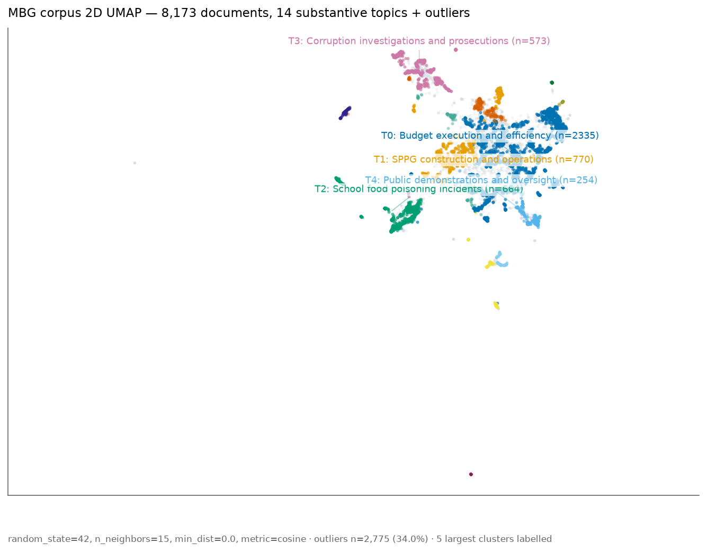
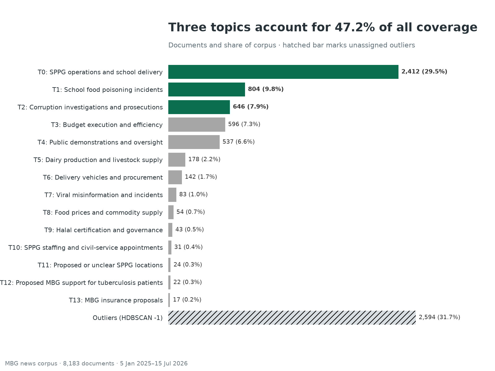
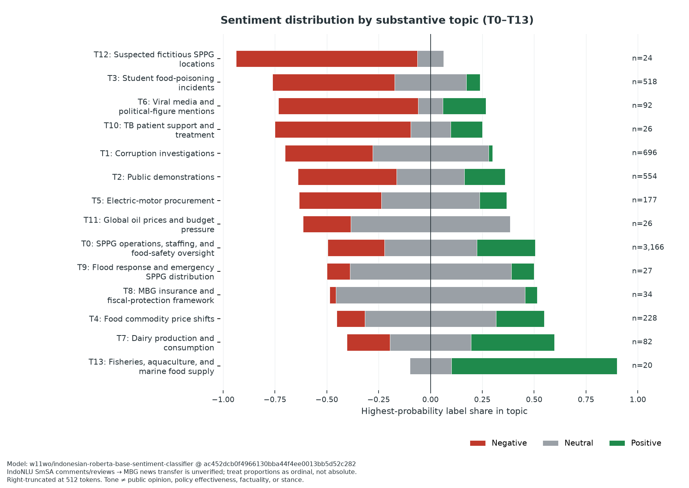
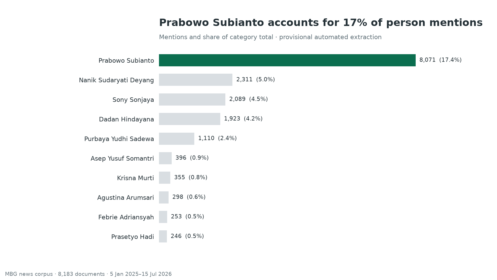
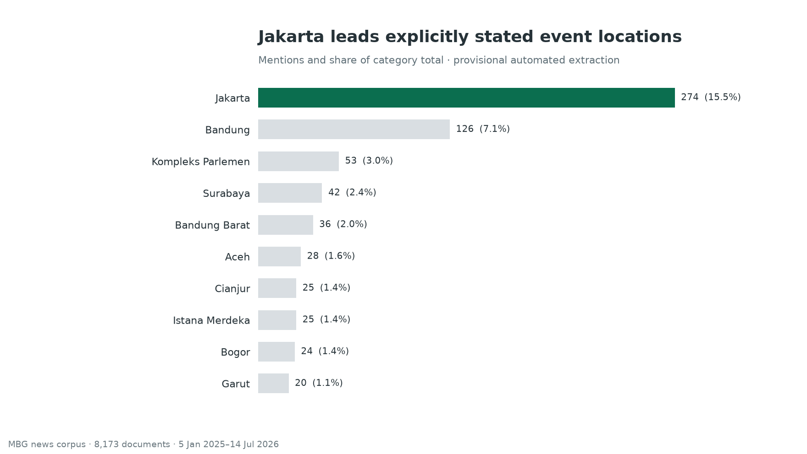
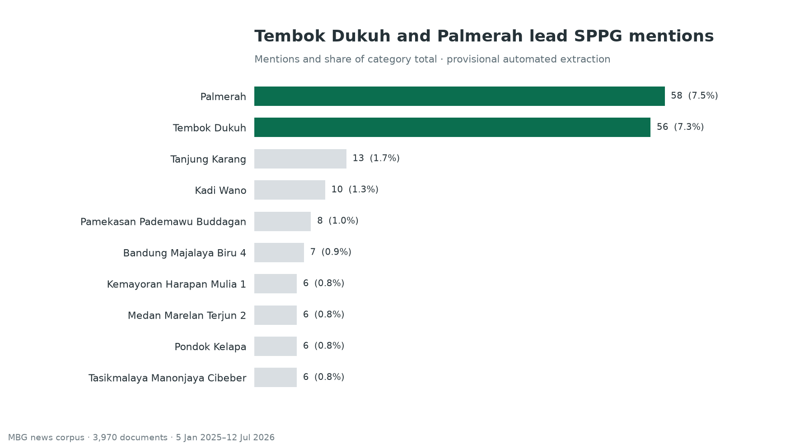

# MBG Use Case: Collecting and Analyzing Indonesian News on Makan Bergizi Gratis

This guide walks the public workflow — from collection through aggregate
analysis — for the *Makan Bergizi Gratis* (MBG) policy research corpus
covering **2025-01-05 through 2026-07-15**, using the `newswatch` registry
exactly as it is currently configured. It is the companion to
`practical-guide.md`; it does not duplicate installation, configuration, or
troubleshooting content.

## Background: What Is MBG?

*Makan Bergizi Gratis* (MBG) is Indonesia's national free nutritious-meals
program, administered by the Badan Gizi Nasional (BGN). It provides meals
designed against daily nutritional adequacy standards for school students,
pregnant women, breastfeeding mothers, and young children. Delivery is
organized through *Satuan Pelayanan Pemenuhan Gizi* (SPPG), the local service
units that prepare and distribute meals.

BGN describes MBG as both a nutrition intervention and a platform for nutrition
education. Its operating model also links SPPG procurement with local farmers,
fishers, cooperatives, and small businesses. This scale makes MBG a useful news
research case: reporting spans beneficiary access, kitchen expansion, food
safety, procurement, public finance, regional implementation, oversight, and
political accountability.

The corpus starts on **5 January 2025**, when BGN formally introduced the 2025
program, and includes implementation from **6 January 2025** onward. Official
program context and operating details are available from:

- [BGN's program launch statement](https://www.bgn.go.id/news/artikel/bgn-akan-memulai-program-mbg-secara-bertahap)
- [BGN's MBG frequently asked questions](https://www.bgn.go.id/faq)
- [BGN's SPPG quality-oversight statement](https://www.bgn.go.id/news/siaran-pers/bgn-perkuat-pengawasan-sppg-untuk-menjaga-kualitas-penyelenggaraan-program-mbg)

## Collection Command

Run the stable, search-capable registry subset against the MBG keywords for the
declared window. `--scrapers all` resolves every stable entry with
`supports_search=True`, not all 72 registered sources.

```bash
uv run newswatch \
  --method search \
  --keywords "mbg,makan bergizi gratis,program MBG,satuan pelayanan pemenuhan gizi,SPPG,badan gizi nasional" \
  --start_date "2025-01-05" \
  --daterange "2025-01-05/2026-07-15" \
  --scrapers all \
  --scraper-timeout 180 \
  --output_format jsonl \
  --output_path mbg-all.jsonl \
  --progress
```

What `--scrapers all` resolves to in this repo:

- 72 registry entries total.
- 66 stable entries support search and are resolved by `--scrapers all`.
- Banten News supports search but remains `investigating`, so the stable CLI
  resolver excludes it; its two retained 13–14 July records were collected in
  a separate bounded pass.
- 5 entries support latest collection only and are skipped by search runs:
  `aljazeera`, `balipost`, `dandapala`, `hukumonline`, and `independen`.


## Corpus Validation

Validate each collection before analysis; retrieval totals are evidence about
that run, not fixed properties of the news ecosystem.

1. **Check the schema.** Require `title`, `publish_date`, `content`, `link`, and
   `source` on every record. Reject malformed rows rather than filling missing
   evidence with inferred values.
2. **Enforce the study window.** Parse publication timestamps and retain only
   records from 2025-01-05 through 2026-07-15 inclusive of both full calendar days (i.e. 2025-01-05 00:00:00 through 2026-07-15 23:59:59). Report
   unparseable and out-of-window rows separately.
3. **Confirm relevance.** Keep a record only when its title contains standalone
   `MBG` or an explicit program term: `Makan Bergizi Gratis`, `Program MBG`,
   `satuan pelayanan pemenuhan gizi`, `SPPG`, `Badan Gizi Nasional`, or `BGN`.
   Matching is case-insensitive, and acronym boundaries reject collisions such
   as `PVMBG`. Title anchoring excludes tangential articles that mention an MBG
   term only in the body.
4. **Remove duplicates in order.** Deduplicate exact article links first, then
   lowercase and collapse whitespace in titles before removing repeated titles.
   Preserve the number removed at each step so the final corpus is auditable.
5. **Publish aggregates only.** Reconcile retained records by source and calendar
   month, but keep article text, titles, URLs, and document-level outputs in the
   private research workspace.

Inspect the actual numbers in each run; do not treat one retrieval as a fixed
benchmark. The run documented here yielded 24,609 well-formed records before
cleaning, then 17,727 after relevance filtering, 8,216 after URL deduplication,
and 8,183 after normalized-title deduplication. It covered 44 sources and all 19
calendar months in the window. These are one run's retrieval counts, not
estimates of article production.

## Aggregate Analysis

The run documented above — **8,183 cleaned documents**, **44 sources**,
and all **19 calendar months** in the window — supports the aggregate topic
and entity figures below. Topic annotations are **provisional English summaries**
derived from auto-generated Indonesian term statistics and a manual review of
private topic assignments; named entities retain their source-language proper
names. Treat both as working labels pending further validation before citing
them as facts.

### Topic landscape and prevalence

The cleaned corpus resolves to **14 substantive topics plus an outlier class**.
The substantive topics cover SPPG operations, budgets, food safety, corruption,
public oversight, supply chains, and program governance; the outlier class
captures documents that do not cluster cleanly with any dominant theme.



A two-dimensional UMAP projection of the cleaned documents, colored by
topic. Each point is one document. All 14 substantive topics are labeled
directly over their cluster regions within the scatter, while grey points
show documents left unassigned by the clustering model. Separation and
overlap are diagnostic patterns, not proof that the generated labels are
definitive categories.

**Visualization projection (figure only).** The scatter uses a dedicated
UMAP projection tuned for readability (`random_state=42`,
`n_neighbors=30`, `min_dist=0.3`, `metric=cosine`). It is distinct from
the analysis UMAP embedded inside the BERTopic pipeline, which produces
the topic assignments themselves; this second projection only re-lays
the documents out in two dimensions so clusters spread out and the
topic clouds stay legible. Topic assignments and cluster identities
are unchanged.



Topic-size distribution ordered largest to smallest, including the outlier
class. The three largest topics account for **3,862 of 8,183 cleaned documents
(47.2%)**; the remainder is spread across the other 11 substantive topics and
the outlier class, confirming that program coverage is not a single narrative.

![Per-topic document volume across the 19 calendar months from January 2025 through July 2026, with the six largest topics each rendered in a distinct colorblind-safe color and a distinct line style, endpoint labels printed directly at the right margin, and four callout annotations marking contemporaneous coverage families for October 2025 (SPPG expansion and safety-governance), February 2026 (Ramadan menu and delivery adaptation), June 2026 (BGN restructuring and school-holiday operations), and September 2025 T1 (Bandung Barat mass incidents)](assets/mbg/topic_trendline.png)

Per-topic volume over the 19 calendar months in the window for the **six
largest topics**: T0 SPPG operations and school delivery, T1 school
food-poisoning incidents, T2 corruption investigations and prosecutions, T3
budget execution and efficiency, T4 public demonstrations and oversight, and
T5 dairy production and livestock supply. The figure renders each topic in a
**distinct colorblind-safe color and line style** and prints the topic label
directly at the right-hand endpoint of every line, so each series stays
legible without relying on color alone.

Four callouts report exact monthly counts and mark contemporaneous coverage
families rather than causal triggers:

- **October 2025 — T0, 181 documents:** SPPG expansion and safety-governance
  coverage.
- **February 2026 — T0, 294 documents:** Ramadan menu and delivery adaptation.
- **June 2026 — T0, 463 documents:** BGN restructuring and school-holiday
  operations.
- **September 2025 — T1, 225 documents:** Bandung Barat mass incidents. T1
  rises from **6 documents in August** and remains elevated at **151 in
  October**; September, not August, is the peak month.

In **June 2026** the three largest topics combined reach **851 documents**
— about **2.5 times** their previous combined monthly peak of **339**.
This run reports aggregate volume only; annotations describe contemporaneous
news coverage families that happen to align with each spike and are not
claims that those events caused the observed volume. The pattern describes
this retrieved corpus and should not be extrapolated beyond 2026-07-15.

Independent public reporting documents the same contemporaneous coverage
families without quoting private records:

- [Bandung Barat mass-poisoning response, ANTARA (September 2025)](https://www.antaranews.com/berita/5129056/pemkab-bandung-barat-tetapkan-klb-usai-ratusan-siswa-keracunan-mbg)
- [Ramadan dry-food adaptation statement, ANTARA](https://en.antaranews.com/news/405814/free-meals-nutrition-maintained-despite-dry-food-shift-minister)
- [BGN school-holiday audit of MBG kitchens, ANTARA](https://en.antaranews.com/news/419313/bgn-to-fully-audit-free-meal-kitchens-during-school-holidays)
- [SPPG safety certification push after poisoning cases, Kompas](https://money.kompas.com/read/2025/10/03/100000126/usai-kasus-keracunan-bgn-ngebut-sertifikasi-sppg-agar-pangan-aman-)

### Sentiment by topic

The aggregate sentiment classifier shows that news tone varies substantially by
topic. Among the larger substantive topics, school food-poisoning coverage
(T1, **n=804**) has the clearest negative pattern: **58.5%** of documents have
`negative` as their highest-probability label and the mean probability score is
**-0.458**. Corruption investigations and prosecutions (T2, **n=646**) are
mostly neutral by highest-probability label (**55.7%**) but still have a
negative mean score (**-0.377**), reflecting very little positive probability.
By contrast, dairy production and livestock supply (T5, **n=178**) has the
highest mean score among topics with at least 30 documents (**+0.207**).



The figure reports each document's highest-probability label as a share of its
topic; the centered grey marker indicates neutral classification, while the
mean score used for ordering is the topic average of
`P(positive) - P(negative)`. These measures can differ. For example, SPPG
operations and school delivery (T0, **n=2,412**) has **33.9% positive**, **38.6%
neutral**, and **27.5% negative** highest-probability labels, but only a modest
mean score of **+0.072**. Topics T8–T13 each contain at most 54 documents, so
their directions are especially provisional. The heterogeneous outlier class
is retained in aggregate reconciliation but omitted from this substantive-topic
figure.

The complete aggregate results are available as
[per-topic CSV](assets/mbg/topic_sentiment.csv) and
[method/reconciliation JSON](assets/mbg/sentiment_summary.json). Both files
contain topic-level or run-level statistics only; document predictions remain
private.

**Interpretation boundary.** The pinned Indonesian RoBERTa classifier was
trained on IndoNLU SmSA comments and reviews, not MBG news. Its outputs describe
the language tone of retrieved articles after right truncation at 512 model
tokens. They do **not** measure public opinion, policy effectiveness,
factuality, or stance, and the probabilities should be treated as ordinal
comparisons rather than calibrated population estimates.

### Named entities and SPPG kitchens

Provisional entity extraction surfaces the most-mentioned people, event
locations, and SPPG/Dapur kitchen references in the corpus. The figures
below are aggregate counts; surface-form resolution is provisional.



Top-mentioned multi-token people across the corpus. Provisional extraction
yields **46,273 mentions resolved to 5,487 normalized surfaces**. Ranks
describe prominence in this retrieved corpus, not policy importance. Audited
aliases combine `Purbaya`, `Purba`, `Yudhi`, and `Yudhi Sadewa` with
**Purbaya Yudhi Sadewa (1,110 mentions across 266 documents)**. Ambiguous
single-token surfaces such as `Yusuf` are retained in aggregate tables but
excluded from this precision-oriented chart rather than assigned to one person.



Top event locations: **1,773 mentions resolving to 532 unique places**.
These counts **exclude publisher datelines and general geographic
framing** — only locations anchored to a described event (visit, launch,
incident, audit) are counted. As a result, this chart under-represents
places that appear only as byline cities or background geography.



Top SPPG/Dapur (*satuan pelayanan pemenuhan gizi*) kitchen references:
**1,363 mentions resolving to 676 unique kitchen surfaces**. Unit numbers are
preserved where available, while strict normalization excludes regional
collectives and malformed identifiers. These automated identifiers remain
provisional until reconciled against operational records.

### Person co-mention network

The aggregate network connects two normalized person surfaces when they occur
in the same document. A person must appear in at least **25 documents** and
contain at least **two name tokens**; an edge must occur in at least **5
documents** with Jaccard similarity of at least **0.05**. These precision gates
produce **26 nodes and 41 edges** across **5 connected components**. The figure
shows the largest component (**17 nodes**) using a deterministic spring layout
(`seed=42`); node area reflects document frequency, edge width reflects
co-mentioned documents, and color marks detected graph communities.


By weighted degree, the most connected eligible surfaces are **Sony Sonjaya
(976)**, **Prabowo Subianto (941)**, **Dadan Hindayana (813)**, **Nanik
Sudaryati Deyang (653)**, and **Asep Yusuf Somantri (341)**. The largest raw
co-mention count is Dadan Hindayana–Prabowo Subianto (**432 documents**).

**Semantic legend.** The figure encodes three independent attributes:

- **Node area** is proportional to the number of documents that mention the
  person (document frequency of the normalized surface).
- **Edge width** is proportional to the number of documents in which the two
  connected person surfaces co-occur (co-mentioned-document count).
- **Node color** marks the **detected graph community** assigned by the
  community-detection pass on the co-mention graph. Colors are **categorical
  community labels only** — they identify which community each node belongs
  to and carry **no sentiment, no political polarity, and no positive /
  negative meaning**. Red and blue, where they appear, are community
  identifiers, not endorsements or stance markers.

Co-mention describes shared news coverage, not personal relationships,
coordination, endorsement, influence, or causal importance.

The complete aggregate outputs are available as [node metrics
CSV](assets/mbg/person_nodes.csv), [edge metrics
CSV](assets/mbg/person_edges.csv), and [method/reconciliation
JSON](assets/mbg/network_summary.json). Names remain provisional NER surfaces:
there is no general co-reference resolution, and ambiguous identities may
still split or merge. Audited `Purbaya`/`Yudhi Sadewa` fragments are
canonicalized to `Purbaya Yudhi Sadewa`; ambiguous bare `Yusuf` remains
unresolved and is excluded by the two-token network precision gate. No
article-level evidence is published.

## Collection Limitations

Be explicit about what this corpus can and cannot support.

- **Retrieval coverage.** The registry contains 67 search-capable sources;
  44 sources contributed documents retained after cleaning. Five latest-only
  sources (`aljazeera`, `balipost`, `dandapala`, `hukumonline`, and
  `independen`) cannot participate in keyword search. Sources outside the
  registry are not searched.
- **Keyword recall.** Retrieval uses six related queries: `mbg`, `makan bergizi
 gratis`, `program MBG`, `satuan pelayanan pemenuhan gizi`, `SPPG`, and
 `badan gizi nasional`. Articles that discuss implementation without any of
 those terms can still be missed.
- **Completeness.** A finished corpus is bounded by what each scraper's
  search endpoint exposes. Some sources cap depth, return only top-N, or
  paginate inconsistently. Re-running with a tighter window or
  source-by-source will not necessarily close those gaps.
- **Copyright.** Each row is a *news article record*: title, link,
  publish date, author, and a content excerpt as returned by the source's
  own feed/page. The corpus is suitable for aggregate analysis, citation,
  and downstream modeling within fair-use research bounds; it is not a
  redistribution of full article text. Honor each publisher's terms.
